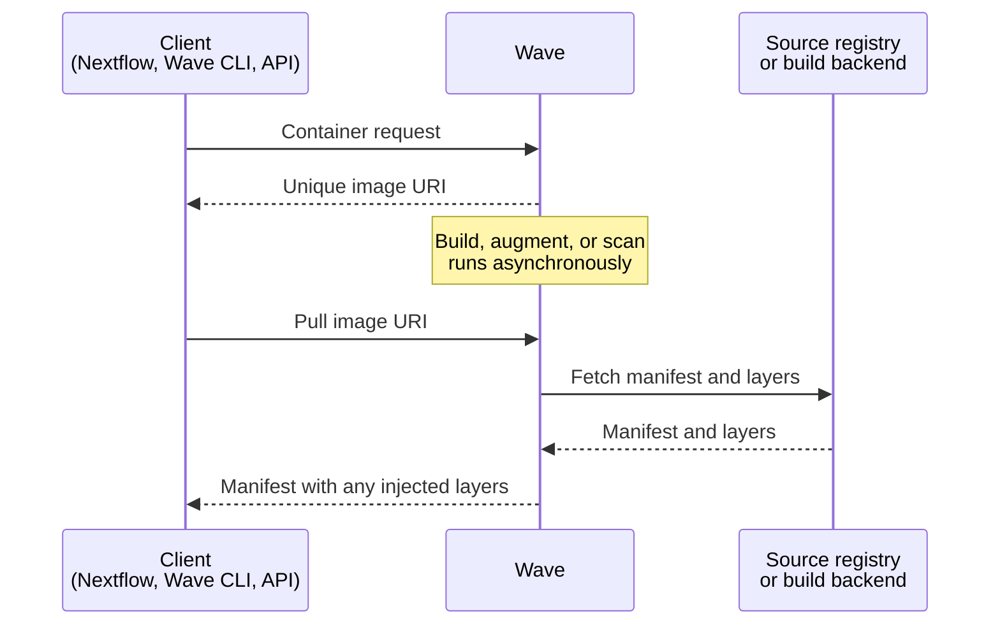

Wave builds, augments, and serves container images on demand. Clients submit a request that references an existing image or supplies build instructions. Wave returns a URI that any OCI-compliant container runtime can pull from. Wave implements the Docker Registry v2 API and acts as a fully OCI-compliant registry.

## The request lifecycle

Wave clients such as Nextflow and the Wave CLI call the container-provisioning API. Wave authenticates the caller against Seqera Platform when a token is supplied and returns a unique image URI immediately. Builds, augmentations, and scans run asynchronously in the background.

When the runtime pulls the URI, Wave holds the connection open until any in-progress work completes. Wave then serves a manifest that combines base layers from the source registry with any layers it injects. Containers behave as if they came from a standard registry, so existing tooling needs no change.



## API limits

Wave applies rate limits to every request. A Seqera access token raises them substantially and unlocks access to private registry credentials stored in Seqera Platform.

- **Authenticated:** 250 builds per hour, 2,000 pulls per minute
- **Anonymous:** 25 builds per day, 100 pulls per hour

Only the manifest request counts as a pull. Layer and blob fetches do not count, so a 100-layer image still costs one pull.

See [API limits](./api.md#api-limits) for examples and edge cases.

## Image URIs

Wave returns one of two URI formats. Both embed a content-based build identifier, so identical inputs always resolve to the same URI and reuse the cached image.

### Ephemeral URIs

Augmentation and on-demand build requests return ephemeral URIs by default. They suit single-use pipeline tasks and expire 36 hours after the request. Ephemeral image names use the following format:

```
wave.seqera.io/wt/<access-token>/wave/build:<checksum>
```

In the example:

- `<access-token>` is a 12-character one-time key with a random component. Wave uses it to authorize the pull and to look up the registry credentials stored in Seqera Platform. The token cannot be predicted or reused after it expires.
- `<checksum>` is a 16-character build identifier derived from the request inputs: the container file, package list, target platform, target repository, and any injected layers.

### Stable URIs

Freeze mode returns the registry URI directly. Stable URIs carry no access token, never expire, and route the runtime to the target registry without involving Wave. Stable image names use the following format:

```
your.registry.com/library/<image-name>:<checksum>
```

In the example:

- `<image-name>` is the image name in your target registry, set when you configure freeze.
- `<checksum>` is the same 16-character build identifier used by ephemeral URIs.

## Serving image layers

Wave acts as an HTTP proxy during a pull. Most public registries (Docker Hub, Quay.io, AWS ECR, Google Artifact Registry) host metadata themselves and offload binary storage to services such as AWS S3, AWS CloudFront, or Cloudflare. Wave returns HTTP redirects in those cases and the runtime pulls the bytes directly from the storage service.

Self-hosted or custom registries sometimes serve layer binaries directly. When Wave fronts such a registry it caches the binaries in object storage and serves them through a CDN. The hosted Wave service uses Cloudflare, the [same approach Docker Hub uses](https://www.cloudflare.com/case-studies/docker/).
