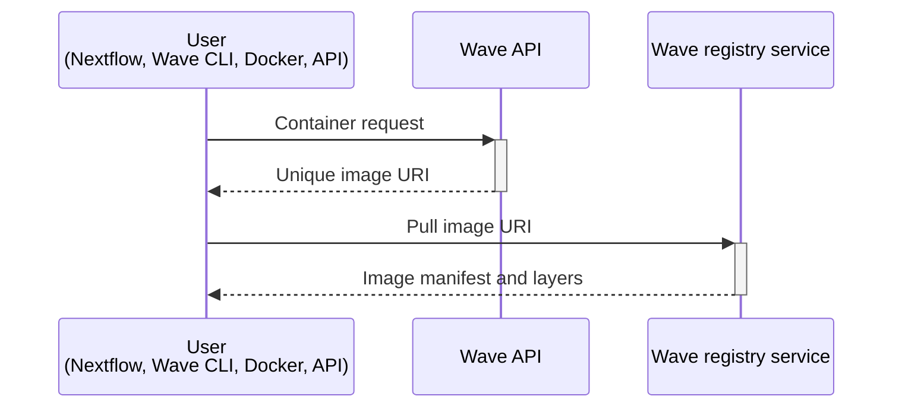

Wave consists of two components: an API that accepts container requests and a registry-compliant service that serves the resulting images. Wave runs as a hosted Seqera service or as a self-hosted Wave Lite deployment.

## Requesting and serving images

Wave clients such as Nextflow and the Wave CLI call the Wave container-provisioning API. Users can reference an existing container image or supply build instructions, such as a Dockerfile, Singularity recipe, Conda packages, Conda environment file, PyPI requirements, or Pixi manifest.

When a client makes a request:

- Wave returns a unique URI. The URI can be used with standard container clients to pull the image.
- Wave processes the request asynchronously. Wave builds or augments the image as required.

Wave implements the Docker Registry v2 API and acts as a fully OCI-compliant container registry. Once a container is requested, Wave manages the pull and delivery:

- Wave holds the client connection while builds, augmentations, and scans complete.
- Wave retrieves base layers directly from the source registry. Wave serves added or modified layers itself.
- Containers behave as if they originated from a standard registry.
- Wave integrates with existing workflows and tooling.

Dynamic modification of images allows users to customize containers for specific workflows without performing a full rebuild. This approach saves time and reduces resource consumption.



## Serving image layers

Wave acts as an HTTP proxy between the container client and the source registry during image pulls. Most public registries, such as Docker.io, Quay.io, and AWS ECR, store only metadata and offload image binary storage to services such as AWS S3, AWS CloudFront, or Cloudflare. In those cases, Wave does not handle the binary layer responses itself. Wave returns HTTP redirects and the client pulls directly from the storage service.

Self-hosted or custom registries sometimes serve image binaries directly rather than redirecting to a CDN. When Wave serves images from such a registry, it caches and serves the binaries through Cloudflare CDN. This is [the same approach used by Docker Hub](https://www.cloudflare.com/case-studies/docker/).

## Wave image URIs

### Ephemeral containers

By default, Wave returns ephemeral containers. Ephemeral URIs are designed for single use. They expire after 36 hours. Ephemeral image names use the following format:

```
wave.seqera.io/wt/<access-token>/wave/build:<checksum>
```

In the example:

- `<access-token>` is a 12-character unique access token. It acts as a one-time key to the image. It unlocks retrieval using credentials stored in Seqera Platform. No Docker-client authentication is required.
- `<checksum>` is a 16-character unique build identifier. It ensures correct caching by the Wave backend and by the client. The checksum changes whenever the build recipe or source changes.

### Stable containers

Wave can persist, or freeze, a container build to a registry. Wave then returns the registry URI in place of an ephemeral URI. These URIs are stable. They include no access token. They do not expire. They point at the target registry directly. The client pulls directly from that registry. Stable image names use the following format:

```
your.registry.com/library/imagename:<checksum>
```

`<checksum>` is the same 16-character build hash used by ephemeral images. It ties the image to its build inputs, providing reproducible, cache-friendly identifiers.
