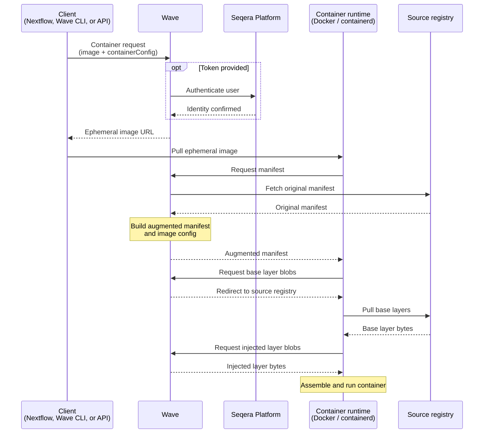

Wave augmentation extends existing container images without a rebuild. Wave generates a new manifest and image config that reference both the original layers and user-injected layers. The base image's blobs are untouched and their checksums are preserved.

Augmentation applies when a container request supplies a `containerConfig` with one or more layers. Wave returns an ephemeral image name. When the container runtime pulls that image, it fetches the base layers from the source registry. Wave injects the additional layers on top.

:::tip
Augmented containers are ephemeral by default and are accessible for 36 hours before the access token expires. To produce a permanent image with a stable URI, use [Container freeze](./container-freezes.mdx) to push the augmented image to a registry of your choice.
:::

## Use cases

Use cases for container augmentation include:

- **Add the Fusion file system** to any existing container. Workloads then access cloud object storage as a POSIX file system.
- **Inject Nextflow [module binaries](https://nextflow.io/docs/latest/module.html#module-binaries)** into task containers. Scripts travel with the pipeline instead of being baked into images.
- **Layer analysis scripts or configuration** into community or vendor images. No private fork is required.
- **Add tunneling or observability agents** to containers used by Seqera Studios or long-running interactive workloads.

## How it works

The augmentation flow runs as follows:

1. A Wave client (Nextflow, the Wave CLI, or the Wave API) submits a container request with:
    - The target container architecture.
    - The name of the container image to augment.
    - A `containerConfig` describing the layers, environment variables, or entrypoint to inject.
2. Wave authenticates the caller. If the request includes a Seqera Platform access token, Wave verifies it. If the Wave deployment permits anonymous access and the request omits a token, Wave processes the request anonymously.
3. Wave returns an ephemeral image name, for example, `wave.seqera.io/wt/<access-token>/library/alpine:latest`. The 12-character random access token authorizes the follow-up pull and expires 36 hours after the request.
4. The container runtime pulls the ephemeral image. Wave intercepts the manifest request and returns a modified manifest that references both the original layers and the injected layers.
5. The container runtime pulls base layer blobs from the source registry. Wave redirects these requests rather than serving the bytes itself. Injected layer blobs come from Wave or from a source URL Wave returns. The exact path depends on how you supplied the layer.
6. The container runtime assembles the final image from all layers.

