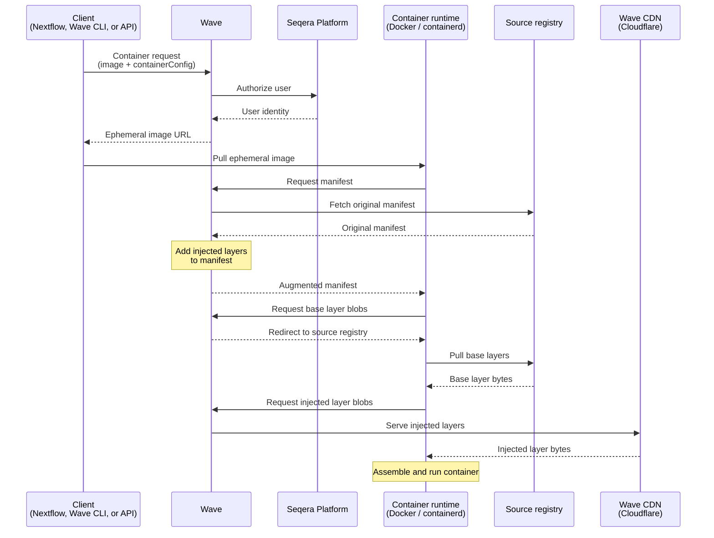

Wave augmentation extends existing container images without a rebuild. Wave adds user-provided content as extra layers when the image is pulled. The original image is untouched. Its layer checksums are preserved.

Augmentation is activated when a container request supplies a `containerConfig` with one or more layers. Wave returns an ephemeral image name. The container runtime pulls the base image directly from the source registry. Wave injects the additional layers during the pull.

## Use cases

Use cases for container augmentation include:

- **Add the Fusion file system** to any existing container. Workloads then access cloud object storage as a POSIX file system.
- **Inject Nextflow [module binaries](https://nextflow.io/docs/latest/module.html#module-binaries)** into task containers. Scripts travel with the pipeline instead of being baked into images.
- **Layer analysis scripts or configuration** into community or vendor images. No private fork is required.
- **Add tunneling or observability agents** to containers used by Seqera Studios or long-running interactive workloads.

## How it works

The augmentation flow involves the client, Wave, the source registry, and a CDN:

1. A Wave client (Nextflow, the Wave CLI, or the Wave API) submits a container request with:
    - The target container architecture (AMD64 or ARM64).
    - The user identity.
    - The name of the container image to augment.
    - A `containerConfig` describing the layers, environment variables, or entrypoint to inject.
2. Wave validates the request and authorizes the user against the Seqera Platform service.
3. Wave returns an ephemeral image name, for example `wave.seqera.io/wt/<TOKEN>/library/alpine:latest`. The 12-character access token identifies and authorizes the follow-up pull.
4. The container runtime pulls the ephemeral image. Wave intercepts the manifest request and returns a modified manifest that references both the original layers and the injected layers.
5. The container runtime pulls base layer blobs directly from the source registry. It pulls injected layer blobs from Wave, served through Cloudflare CDN.
6. The container runtime assembles the final image from all layers.

Augmentation runs no hidden build operations. Wave modifies only the container manifest; the underlying layer blobs are untouched, so the original image checksums are preserved.

Augmented containers are ephemeral by default and are accessible for 36 hours before the access token expires. To produce a permanent image with a stable URI, use [container freeze](./container-freezes.mdx) to push the augmented image to a registry of your choice.
