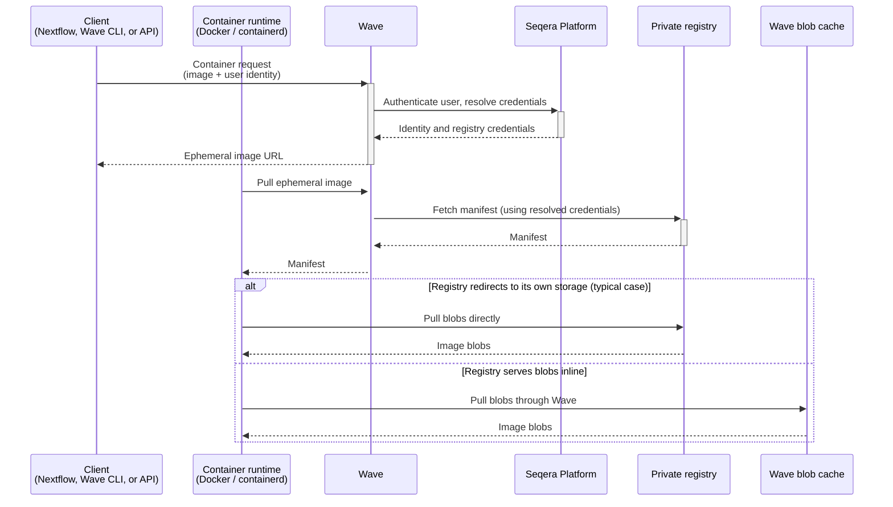

Wave provides transparent access to private container registries. Credentials live in Seqera Platform. You do not handle registry passwords, access tokens, or Docker config files directly.

Wave supports Docker Hub, Quay.io, AWS ECR (private and public), Azure Container Registry, Google Artifact Registry, GitHub Container Registry, and any OCI (Open Container Initiative)-compliant self-hosted registry. Credentials are added in [Seqera Platform credentials](https://docs.seqera.io/platform/latest/credentials/overview/). When a Wave client runs, Wave uses the stored credentials on your behalf to pull from the source registry. For freeze and mirror operations, Wave also pushes to the target registry.

:::note
See [Credentials overview](https://docs.seqera.io/platform/latest/credentials/overview/) for setup details.
:::

## Use cases

Use cases for private registry authentication include:

- **Centralized credential management**: Credentials live in Seqera Platform as a single source of truth. They integrate with Platform role-based access control.
- **No per-pipeline configuration**: Pipelines reference images by URI, and Wave resolves the credentials.
- **Reduced credential leakage risk**: Secrets are not stored in pipeline code or Docker config files.
- **Cross-registry pipelines**: Access and publish private images across multiple providers in a single run, including Docker Hub, Quay.io, ECR, ACR, GAR, GHCR, and self-hosted registries.

## How it works

The authentication flow runs as follows:

1. A Wave client (Nextflow, the Wave CLI, or the Wave API) submits a container request with the private image URI and your Seqera Platform access token.
2. Wave authenticates the caller against Seqera Platform and resolves the registry credentials stored in your workspace.
3. Wave returns an ephemeral container image name, for example `wave.seqera.io/wt/<access-token>/library/alpine:latest`. The 12-character access token is a short-lived random key scoped to this request. It authorizes the follow-up pull without requiring the container runtime to supply source-registry credentials.
4. The container runtime pulls the ephemeral image. Wave resolves credentials for the source registry and fetches the manifest. For most public registries, Wave returns an HTTP redirect and the runtime pulls blobs directly from the registry's storage. When a source registry serves blob bytes inline, Wave caches and streams the blobs through its blob cache.



### Credential resolution

Wave resolves registry credentials based on whether the request is authenticated:

- **Authenticated requests** use credentials stored in your Seqera Platform workspace. Wave queries the Platform credentials service with your access token, matches credentials by registry hostname, and uses the first matching entry.
- **Anonymous requests** and requests targeting Wave's own build, cache, or public repositories use credentials configured by the Wave operator.

For AWS ECR, Wave can additionally authenticate using its own cloud identity, removing the need to store ECR credentials in your workspace.

The workspace used for credential lookup depends on the request context. If `tower.workspaceId` is set in the Nextflow configuration, Wave uses that workspace. Otherwise, Seqera Platform defaults to your personal workspace.

## Registry-specific notes

### AWS ECR Private Registry

Wave can authenticate to private AWS ECR registries using IAM credentials stored in Seqera Platform. The registry hostname follows the format `<account-id>.dkr.ecr.<region>.amazonaws.com`.

The IAM user needs `ecr:GetAuthorizationToken`, `ecr:BatchGetImage`, and `ecr:GetDownloadUrlForLayer` permissions. The AWS managed policy `AmazonEC2ContainerRegistryReadOnly` covers these. See [AWS ECR credentials](https://docs.seqera.io/platform/latest/credentials/aws_registry_credentials) for step-by-step setup in Seqera Platform.

### AWS ECR Public Registry

Amazon ECR Public Gallery (`public.ecr.aws`) hosts publicly accessible container images. While images are freely accessible without authentication, AWS applies rate limits to unauthenticated pulls. Authenticating with AWS credentials removes these rate limits and is required when running pipelines at scale.

#### Differences from private ECR

| Feature | Private ECR | Public ECR |
|---------|-------------|------------|
| Hostname | `<account-id>.dkr.ecr.<region>.amazonaws.com` | `public.ecr.aws` |
| Authentication endpoint | Region-specific | Always `us-east-1` |
| Unauthenticated access | Not available | Available, but rate-limited |
| AWS API | `ecr:GetAuthorizationToken` | `ecr-public:GetAuthorizationToken` |

#### Required IAM permissions

The IAM user needs the following permissions to authenticate to ECR Public:

- `ecr-public:GetAuthorizationToken`
- `ecr-public:BatchCheckLayerAvailability`
- `ecr-public:GetRepositoryPolicy`
- `ecr-public:DescribeRepositories`
- `ecr-public:DescribeImages`
- `ecr-public:DescribeImageTags`
- `sts:GetServiceBearerToken` — required for ECR Public token exchange

Attach the AWS managed policy `AmazonElasticContainerRegistryPublicReadOnly` and the `sts:GetServiceBearerToken` permission explicitly, or create a custom policy that includes all of the above.

:::note
`sts:GetServiceBearerToken` is not included in `AmazonElasticContainerRegistryPublicReadOnly`. You must grant this permission separately, or ECR Public authentication will fail.
:::

#### Configure ECR Public credentials in Seqera Platform

1. Go to **Credentials** in your organization workspace, or go to **Your credentials** from the user menu in your personal workspace.
2. Select **Add Credentials** and complete the form:
   - **Provider**: Select **Container registry**.
   - **User name**: Your IAM access key ID.
   - **Password**: Your IAM secret access key.
   - **Registry server**: `public.ecr.aws`
3. Select **Add**.

Wave matches the `public.ecr.aws` hostname to these credentials and uses them to authenticate pulls from ECR Public.

#### Configure ECR Public for self-hosted Wave

For self-hosted Wave deployments, add ECR Public credentials to your Wave configuration:

```yaml
wave:
  registries:
    "public.ecr.aws":
      username: ${AWS_ACCESS_KEY_ID}
      password: ${AWS_SECRET_ACCESS_KEY}
```

:::note
ECR Public authentication always uses the `us-east-1` endpoint, regardless of the region where Wave is deployed or where your images are hosted. Wave handles this automatically.
:::
