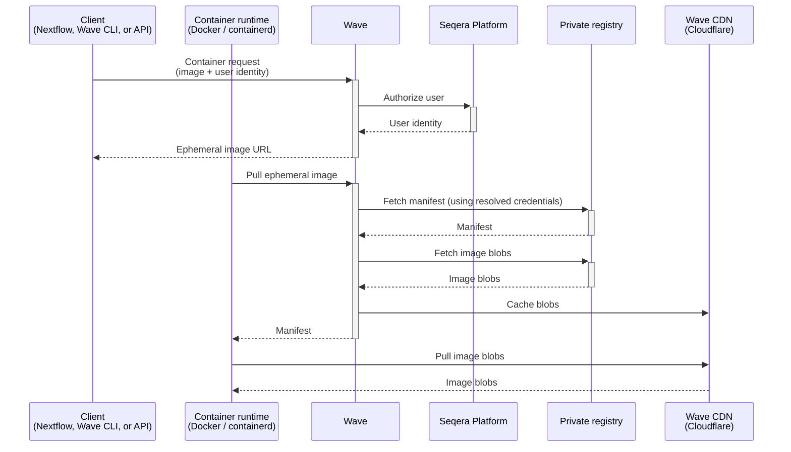

Wave provides transparent access to private container registries. Credentials are stored in Seqera Platform. Users do not handle registry passwords, access tokens, or Docker config files directly.

Wave supports Docker Hub, Quay.io, AWS ECR (private and public), Azure Container Registry, Google Artifact Registry, GitHub Container Registry, and any OCI-compliant self-hosted registry. Credentials are added in [Seqera Platform credentials](https://docs.seqera.io/platform/latest/credentials/overview/). When a Wave client runs, Wave uses the stored credentials on the user's behalf to pull from the source registry. For freeze and mirror operations, Wave also pushes to the target registry.

:::note
See [Credentials overview](https://docs.seqera.io/platform/latest/credentials/overview/) for setup details.
:::

## Use cases

Use cases for private registry authentication include:

- **Centralized credential management**: Credentials live in Seqera Platform as a single source of truth, integrated with Platform role-based access control.
- **No per-pipeline configuration**: Pipelines reference images by URI, and Wave resolves the credentials. No per-registry setup is required in pipeline code.
- **Reduced credential leakage risk**: Secrets are not stored in pipeline code or Docker config files.
- **Cross-registry pipelines**: Access and publish private images across multiple providers in a single run, including Docker Hub, Quay.io, ECR, ACR, GAR, GHCR, and self-hosted registries.

## How it works

The authentication flow involves the client, Wave, Seqera Platform, the private registry, and a CDN:

1. A Wave client submits a container request with the private image URI and the user's identity. Wave clients include Nextflow, the Wave CLI, and the Wave API.
2. Wave validates the request and authorizes the user against Seqera Platform.
3. Wave returns an ephemeral container image name, for example `wave.seqera.io/wt/<TOKEN>/library/alpine:latest`. The 12-character access token is a single-use key that authorizes the follow-up pull without the container runtime supplying source-registry credentials.
4. The container runtime pulls the ephemeral image. Wave resolves credentials for the source registry, fetches the manifest, and caches the image blobs. Blobs are served to the runtime through a Cloudflare CDN.
5. The ephemeral token and cached layers expire after 36 hours.

### Credential resolution

Wave resolves credentials for each registry host. It attempts sources in a fixed order and uses the first match.

1. **Platform workspace credentials.** Wave queries the Platform credentials service using the user's access token. Platform returns the credentials in the scoped workspace. Wave matches them by registry hostname and uses the first entry that matches.
2. **Wave server static credentials.** If no workspace credential matches, Wave uses static credentials configured on the Wave server under `wave.registries.<host>.username` and `wave.registries.<host>.password` as a fallback. This source is also used for requests to Wave's own build, cache, and public repositories.
3. **Wave's cloud identity.** For AWS ECR, Google Artifact Registry, and Azure Container Registry, Wave can authenticate using its own cloud identity: IAM Roles for Service Accounts on AWS, Workload Identity on Google Cloud, or a Managed Identity on Azure. This source is used only when the first two do not apply.

Platform workspace credentials are evaluated first because they encode the user's explicit intent. The workspace used for lookup depends on the request context: if `tower.workspaceId` is set in the Nextflow configuration, Wave uses that workspace; otherwise Platform defaults to the user's personal workspace.
