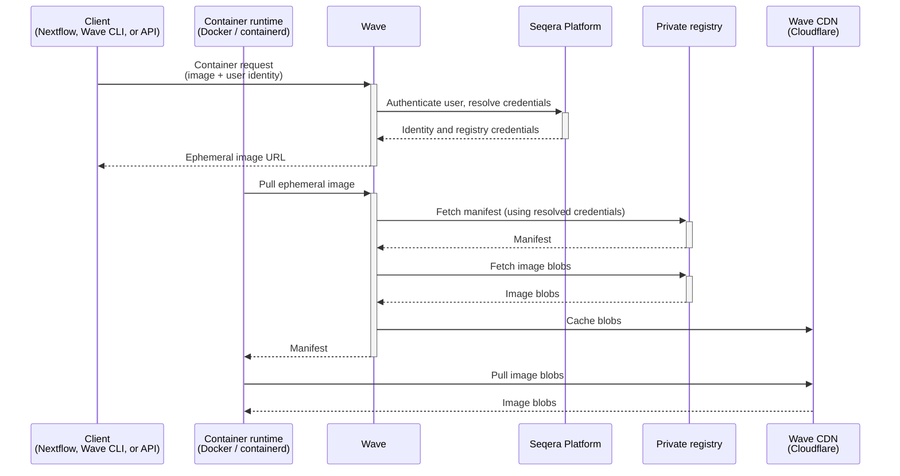

Wave provides transparent access to private container registries. Credentials live in Seqera Platform, so users do not handle registry passwords, access tokens, or Docker config files directly.

Wave supports Docker Hub, Quay.io, AWS ECR (private and public), Azure Container Registry, Google Artifact Registry, GitHub Container Registry, and any OCI-compliant self-hosted registry. Credentials are added in [Seqera Platform credentials](https://docs.seqera.io/platform/latest/credentials/overview/). When a Wave client runs, Wave uses the stored credentials on the user's behalf to pull from the source registry. For freeze and mirror operations, Wave also pushes to the target registry.

:::note
See [Credentials overview](https://docs.seqera.io/platform/latest/credentials/overview/) for setup details.
:::

## Use cases

Use cases for private registry authentication include:

- **Centralized credential management**: Credentials live in Seqera Platform as a single source of truth, integrated with Platform role-based access control.
- **No per-pipeline configuration**: Pipelines reference images by URI, and Wave resolves the credentials. No per-registry setup is required in pipeline code.
- **Reduced credential leakage risk**: Secrets are not stored in pipeline code or Docker config files.
- **Cross-registry pipelines**: Access and publish private images across multiple providers in a single run, including Docker Hub, Quay.io, ECR, ACR, GAR, GHCR, and self-hosted registries.

## How it works

The authentication flow involves the client, Wave, Seqera Platform, the private registry, and a CDN:

1. A Wave client (Nextflow, the Wave CLI, or the Wave API) submits a container request with the private image URI and the user's Seqera Platform access token.
2. Wave authenticates the caller against Seqera Platform and resolves the registry credentials stored in the user's workspace.
3. Wave returns an ephemeral container image name, for example `wave.seqera.io/wt/<access-token>/library/alpine:latest`. The 12-character access token is a single-use key that authorizes the follow-up pull without the container runtime supplying source-registry credentials.
4. The container runtime pulls the ephemeral image. Wave resolves credentials for the source registry, fetches the manifest, and caches the image blobs. Blobs are served to the runtime through a Cloudflare CDN.
5. The ephemeral token expires after 36 hours.

### Credential resolution

Wave resolves registry credentials based on whether the request is authenticated:

- **Authenticated requests** use credentials stored in the user's Seqera Platform workspace. Wave queries the Platform credentials service with the user's access token, matches credentials by registry hostname, and uses the first matching entry.
- **Anonymous requests, and requests targeting Wave's own build, cache, or public repositories,** use credentials configured by the Wave operator.

For AWS ECR, Wave can additionally authenticate using its own cloud identity, removing the need to store ECR credentials in the user's workspace.

The workspace used for credential lookup depends on the request context: if `tower.workspaceId` is set in the Nextflow configuration, Wave uses that workspace; otherwise Platform defaults to the user's personal workspace.
