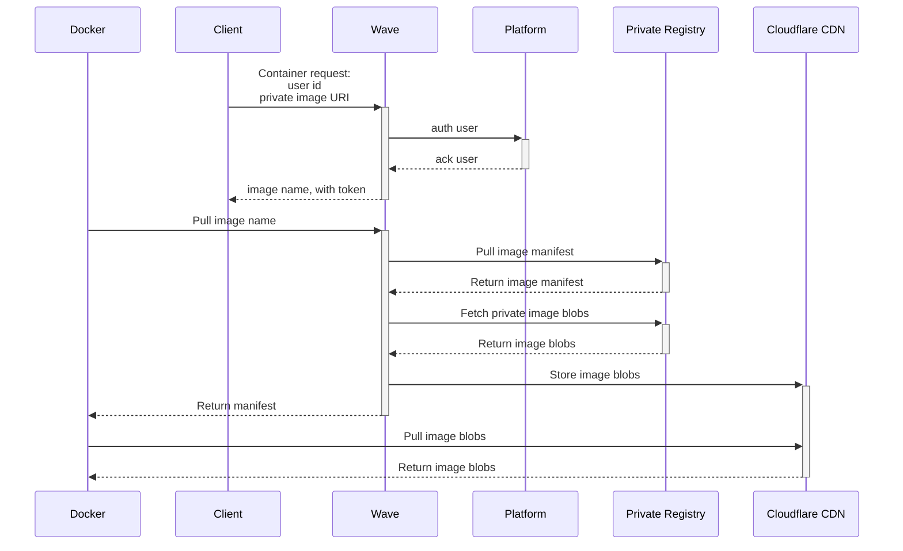

Wave gives you transparent access to private container registries. Credentials live in Seqera Platform. You never handle registry passwords, access tokens, or Docker config files directly.

Add the credentials in [Seqera Platform credentials](https://docs.seqera.io/platform/latest/credentials/overview/). When a pipeline runs, Wave uses them on the user's behalf to pull from the registry. For freeze and mirror operations, Wave also pushes.

Use cases include:

- **Centralized credential management**: Credentials live in Seqera Platform. One source of truth. Integrates with platform role-based access control.
- **Simplified configuration**: No manual authentication per registry. Pipelines reference images by URI. Wave resolves the credentials.
- **Enhanced security**: No secrets in pipeline code. No Docker config files. Less risk of credential leakage.
- **Cross-registry pipelines**: One pipeline references private images from Docker Hub, Quay.io, AWS ECR, Azure Container Registry, Google Artifact Registry, and self-hosted registries. No local Docker logins.

:::note
See [Credentials overview](https://docs.seqera.io/platform/latest/credentials/overview/) for setup details.
:::

## How it works

1. A Wave client (Nextflow, the Wave CLI, or the API) submits a container request with the private image URI and the user identity.
2. Wave validates the request and authorizes the user against the Seqera Platform service.
3. Wave responds with an ephemeral container image name — for example, `wave.seqera.io/wt/<ID_TOKEN>/library/alpine:latest`.

    :::note
    The `ID_TOKEN` is a temporary, single-use access key. It lets the Docker client retrieve the image without credentials for the source registry.
    :::

4. The Docker client requests the manifest from the Wave registry endpoint. It supplies no registry credentials.
5. Wave authenticates to the source registry with the stored Seqera Platform credentials. Wave retrieves the manifest and caches the image blobs. Blobs are served to the Docker client via Cloudflare CDN.
6. After 36 hours, the layer cache and ephemeral token expire.

## Detailed authentication flow

