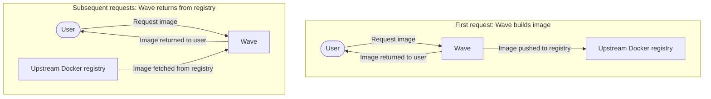

Wave builds container images from a Dockerfile, Singularity recipe, Conda packages, a Conda environment file, a PyPI requirement, or a Pixi manifest. This *just-in-time (JIT)* strategy creates images on demand. You no longer need to pre-build and curate images ahead of each pipeline run. Wave returns an image URI immediately while the build completes in the background.

Use cases include:

- **Rapid development**: Generate containerized environments instantly. Iterate on dependencies by editing the Dockerfile or Singularity definition — no manual builds. New software ships with an image.
- **Optimized resource usage**: Wave builds only what you request. Storage costs drop because you keep no large pre-built image library.
- **Simplicity**: Declare tools in a Conda environment file. Wave generates the image. No boilerplate pipeline code.
- **Portability**: Build instructions live inside the pipeline. A Conda-first pipeline adapts to any container technology with no rewrites.
- **Reproducibility**: Wave stores build logs. Conda builds also produce precise lock files. Environments are consistent, shareable, and reproducible.

## How it works

1. Wave starts the build when it receives build instructions. Instructions come from a Nextflow pipeline, the CLI, or the API.
2. If the image already exists in the cache or remote registry, Wave returns it immediately. Otherwise Wave builds the image on demand. Wave returns a unique image URI straight away and runs the build and security scan in the background.
3. The Docker client (or any compatible tool) pulls the image from the returned URI. If the image is still building, the pull waits for the build to finish.



## Build from a container file

Wave builds containers from Dockerfiles and Singularity build files. You define the environment. Wave handles the build and picks the right infrastructure and CPU architecture.

The CLI has an optional flag for a build context directory. Dockerfiles can then use `ADD` and `COPY` instructions. Nextflow supplies the build context automatically. See [Module binaries](https://www.nextflow.io/docs/latest/module.html#module-binaries).

Set the `platform` request parameter to `linux/amd64` or `linux/arm64` to target a specific architecture. See [Multi-architecture support](./architectures.mdx).

## Build from Conda packages

Conda is a widely used package and environment manager in the bioinformatics community. Bioconda and conda-forge handle dependency resolution and installation. Wave provisions container images from either a list of Conda package names or an `environment.yml` file. There is no need for pre-built images or manual container management.

If you provide only package names, Wave generates an `environment.yml` using the `conda-forge` and `bioconda` channels by default. Wave then builds the image from a Dockerfile based on `mambaorg`/`micromamba`. The channels, environment file, base image, and Dockerfile are all customizable.

Request a Singularity image and Wave uses a Singularity build file for a native Singularity build.

:::note
Anaconda Inc., the company behind Conda, applies commercial licensing to parts of its ecosystem, including the `default` Conda channel. These requirements apply to organizations with over 200 employees. The Conda package manager itself remains open source. Community channels like `conda-forge` and `bioconda` provide free access to packages. Wave does not use the `default` channel, so these licensing restrictions do not affect Wave users.
:::

## Conda lock files

Conda lock files make environments reproducible. A lock file records the exact version of every dependency, the build specification, the source channel, and the package `md5sum`. Running the same lock file recreates the same environment on any system. Lock files also skip the environment-resolution step and shave significant time off setup.

Wave generates Conda lock files as part of the build. A lock file lets you reproduce any Wave-built image exactly. Lock files also make a useful record for debugging, sharing, and archiving pipelines. Wave can also build images directly from an existing Conda lock file.

## Build from the Python Package Index

Wave can include Python packages from the [Python Package Index (PyPI)](https://pypi.org/) in container builds. Add PyPI packages to a Conda-based build by listing them in the Conda environment file.

Declare `pip` as a dependency. Add a `pip` section listing the PyPI packages. For example:

```yaml
name: my-env
dependencies:
  - python=3.9
  - pip
  - pip:
    - numpy
    - pandas==1.5.0
    - matplotlib
```

This setup installs both Conda and PyPI packages during the build.

## Build from Pixi

Wave builds container images from a [Pixi](https://pixi.sh/) manifest. Pixi is a package manager built on the Conda ecosystem. It uses a per-project `pixi.toml` (or `pyproject.toml`) and a `pixi.lock` lock file to produce fast, reproducible environments across platforms.

Pixi builds follow the same JIT pattern as Dockerfile and Conda builds. Submit the manifest, receive an image URI, and pull once the build completes. Pixi is a good fit when the source environment is already defined for Pixi elsewhere in the project. It also shines when you need the reproducibility guarantees of a committed `pixi.lock`.

## Build logs and artefacts

Every build produces logs. Conda builds also produce a lock file. The build service exposes them via dedicated endpoints:

- `GET /v1alpha1/builds/{buildId}` — status and metadata.
- `GET /v1alpha1/builds/{buildId}/logs` — full build log output.
- `GET /v1alpha1/builds/{buildId}/status` — lightweight status polling.
- `GET /v1alpha1/builds/{buildId}/condalock` — generated Conda lock file (Conda builds only).

Seqera Platform uses these endpoints to surface build progress. Programmatic clients use them for direct access to build outputs.
