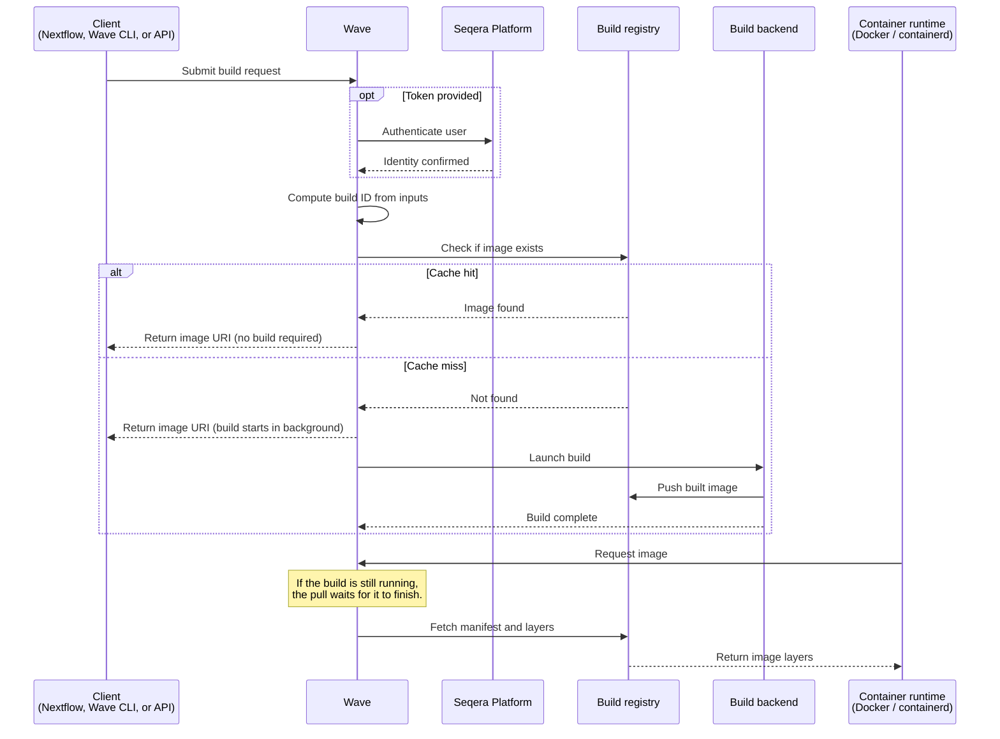

Wave builds container images from a Dockerfile, Singularity recipe, Conda packages, Conda environment file (which can include PyPI packages), Conda lock file, or list of CRAN packages. Conda builds can use Micromamba or Pixi templates. This *just-in-time (JIT)* strategy creates images on demand. You don't need to pre-build and curate images ahead of each pipeline run. Wave returns an image URI immediately. The build runs in the background.

## Use cases

Use cases for building custom images on demand include:

- **Rapid development**: Edit a Dockerfile or Singularity recipe and Wave produces a new image on the next run. No manual build step is required.
- **Optimized resource usage**: Wave builds only what is requested, which avoids the need to maintain a large pre-built image library.
- **Simplicity**: Declare tools in a Conda environment file. Wave generates the image. Pipelines remain free of boilerplate.
- **Portability**: Build instructions reside inside the pipeline. A Conda-first pipeline adapts to any container technology without rewrites.
- **Reproducibility**: Wave stores build logs for every build. Conda builds also produce precise lock files. Environments remain consistent, shareable, and reproducible.
- **Multi-architecture workloads**: Build the same Dockerfile or Conda specification for `linux/amd64` or `linux/arm64`. Pipelines target the hardware that matches their cost and performance goals, including ARM cloud instances such as AWS Graviton, Azure Cobalt, and Google Cloud Axion.

## How it works

The build flow runs as follows:

1. A client submits build instructions. Instructions come from a Nextflow pipeline, the Wave CLI, a direct Wave API call, or the Seqera Containers web interface for Conda and PyPI builds.
2. Wave authenticates the caller. If the request includes a Seqera Platform access token, Wave verifies it. If the Wave deployment permits anonymous access and no token is supplied, Wave processes the request anonymously.
3. Wave computes a content-based build ID from the inputs. If the image already exists in the target registry, Wave returns the existing image URI. Otherwise Wave starts a build in the background and returns a URI immediately.
4. A container runtime pulls the image from the returned URI. If the build is still running, the pull waits until the build completes.

The build ID is a 16-character hash derived from the container file, Conda file, platform, target repository, build context, and container config. Identical inputs always produce the same ID. Concurrent requests for the same image share a single build.



Wave runs the build either as a local Docker build or as a Kubernetes job, depending on the deployment. On-demand builds are not available in Wave Lite. See the [feature matrix](./index.mdx) for the capabilities supported by each deployment.

### Build from a Dockerfile or Singularity recipe

Wave builds containers from Dockerfiles and Singularity build files. You define the environment. Wave handles the build and selects the appropriate infrastructure and CPU architecture.

The Wave CLI accepts an optional build context directory. Dockerfiles can then use `ADD` and `COPY` instructions to include local files. Nextflow supplies the build context automatically from the pipeline. See [Module binaries](https://www.nextflow.io/docs/latest/module.html#module-binaries).

Set the `containerPlatform` field on the build request to `linux/amd64` or `linux/arm64` to target a specific architecture (the Wave CLI exposes this as `--platform`). The same Dockerfile or Conda specification builds for either target. Wave returns an image URI that resolves to the matching binary. Both Wave and Wave Lite support `linux/amd64` and `linux/arm64`.

:::note
`linux/arm64` is not the same as Apple Silicon. Apple Silicon uses a system-on-chip design for macOS. `linux/arm64` is the Linux ARM specification used on server and cloud distributions. Wave does not build images for `macos/arm64`.
:::

### Build from Conda packages

Conda is a widely used package and environment manager in the bioinformatics community. Bioconda and conda-forge handle dependency resolution and installation. Wave provisions container images from either a list of Conda package names or an `environment.yml` file. You can submit Conda builds through a Nextflow pipeline, the Wave CLI, the Wave API, or the Seqera Containers web interface. No pre-built images or manual container management are required.

If only package names are provided, Wave generates an `environment.yml` using the `conda-forge` and `bioconda` channels by default. Wave then builds the image from a Dockerfile based on `mambaorg`/`micromamba`. The channels, environment file, base image, and Dockerfile are all customizable.

When a Singularity image is requested, Wave uses a Singularity build file for a native Singularity build.

:::note
Anaconda Inc., the company behind Conda, applies commercial licensing to parts of its ecosystem, including the `default` Conda channel. These requirements apply to organizations with over 200 employees. The Conda package manager itself remains open source. Community channels like `conda-forge` and `bioconda` provide free access to packages. Wave does not use the `default` channel.
:::

### Build from Conda lock files

Conda lock files make environments reproducible. A lock file records the exact version of every dependency, the build specification, the source channel, and the package `md5sum`. Running the same lock file recreates the same environment on any system. Lock files also skip the environment-resolution step. This reduces setup time significantly.

Wave generates a Conda lock file as part of every Conda build. A lock file provides a means to reproduce any Wave-built image exactly. Lock files also provide a useful record for debugging, sharing, and archiving pipelines. Wave can also build images directly from an existing Conda lock file.

### Build from PyPI packages

Wave can include Python packages from the [Python Package Index (PyPI)](https://pypi.org/) in container builds. Add PyPI packages to a Conda-based build by listing them in the Conda environment file. You can submit PyPI-inclusive builds through a Nextflow pipeline, the Wave CLI, the Wave API, or the Seqera Containers web interface.

Declare `pip` as a dependency. Add a `pip` section listing the PyPI packages. For example:

```yaml
name: my-env
dependencies:
  - python=3.9
  - pip
  - pip:
    - numpy
    - pandas==1.5.0
    - matplotlib
```

This setup installs both Conda and PyPI packages during the build.

### Multi-stage Conda builds

By default, Wave produces single-stage Conda images that bundle the package manager with the runtime environment. Two build templates run a two-stage build instead. The first stage installs the environment. The second stage copies only the resolved environment into a minimal base image. Multi-stage builds typically reduce image size by 30–50%. They exclude build tools from the final image and emit a lock file for reproducibility.

Two multi-stage templates are available:

- **`conda/micromamba:v2`** uses Micromamba and produces an `environment.lock` file.
- **`conda/pixi:v1`** uses [Pixi](https://pixi.sh/) and produces a `pixi.lock` file. Conda lock files are not supported through this template. Pixi support was added in Wave 1.31.0.

Select a template with the `buildTemplate` field on the build request. Both templates accept Conda packages and Conda environment files, and both produce Docker and Singularity images.

### Build from CRAN packages

Wave builds container images from a list of [CRAN](https://cran.r-project.org/) packages for R-based workflows. Wave generates a Dockerfile based on a Rocker R image and installs the requested packages at build time.

Every build produces logs, and Conda builds also produce a lock file. Wave exposes build status, log output, and the generated Conda lock file through the Wave API.
