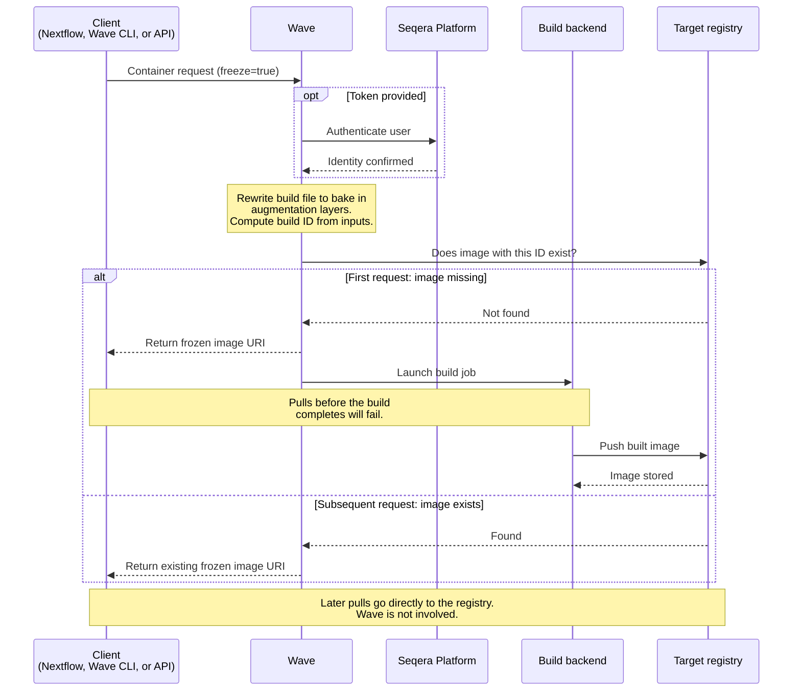

Freeze mode produces a permanent container image in a registry you control. Wave builds the image and pushes it to the target registry. The response is a stable URI that does not expire. Subsequent pulls go directly to the registry and bypass Wave.

Wave rewrites the build file to bake augmentation layers into the image. Augmentation layers include container config, environment variables, and entrypoints. Baking them in avoids dynamic injection at pull time. Freeze requests must specify a target build repository, set in the request or as a default. Singularity (SIF) images always use freeze because their monolithic format cannot accept dynamic layers.

Wave hashes the build inputs to produce a deterministic image ID. Inputs include the container file, the Conda file, the target platform, the target repository, the build context, and the container config. Identical inputs return the existing image. With Nextflow, the build context bundles workflow `bin/` directories and module resources. Changes trigger a rebuild (see [Bundling pipeline scripts](../guides/bundle-scripts.md)). Wave does not cache images locally unless you configure a cache repository.

[Seqera Containers](../seqera-containers.md) is a managed application of freeze that pushes Conda and PyPI images to `community.wave.seqera.io`.

:::tip
To copy an image to another registry without modifying it, use [container mirroring](./mirroring.mdx). Mirroring preserves the original manifest, name, and digest. Freeze returns a new, Wave-built image under a name you choose.
:::

## Use cases

Use cases for container freeze include:

- **Reproducibility and collaboration**: Finalized containers reside in a permanent registry. Collaborators and future workflows use the exact same environment, without reliance on ephemeral builds.
- **Reusability**: Central storage of pre-built images avoids repeated builds. This reduces overhead and pipeline execution time.
- **Archiving for compliance**: Store containers permanently for auditing. Keep a traceable, unaltered record of the environment used for an analysis.
- **Portability**: Deliver images to the same region or cloud account where compute runs. This reduces pull latency and egress costs.
- **Air-gapped or restricted environments**: Compute targets that cannot reach Wave at pull time can still use frozen images, because the image is self-contained in the target registry.

## How it works

The freeze flow runs as follows:

1. The client (Nextflow, the Wave CLI, or the Wave API) submits a container request with:
    - Either a `containerImage` to base the freeze on, or a `containerFile` with build instructions. At least one is required, and you cannot supply both. Even when you supply only `containerImage`, Wave generates a Dockerfile (`FROM <image>`) and runs a build.
    - An optional `containerConfig` that augments the build with additional layers, environment variables, or entrypoints.
    - The target build repository for the new image.
2. Wave authenticates the caller. If the request includes a Seqera Platform access token, Wave verifies it. If the Wave deployment permits anonymous access and no token is supplied, Wave processes the request anonymously.
3. Wave rewrites the Dockerfile (or Singularity definition) to bake augmentation layers into the build.
4. Wave computes a build ID from the rewritten build inputs and checks whether the image already exists in the target registry.
5. Wave responds immediately with the frozen image URI, for example `your.registry.com/<image-path>:1a2b3c4d5e6f7890`. The path comes from the `buildRepository` you supplied. The tag is derived from the build hash and includes a recipe prefix for Conda builds. Singularity images use the `oras://` scheme.
6. If the image is missing, Wave launches a build job in the background and pushes the result to the target registry. The URI returned in step 5 is usable only after the build completes. Pulls before then will fail.

