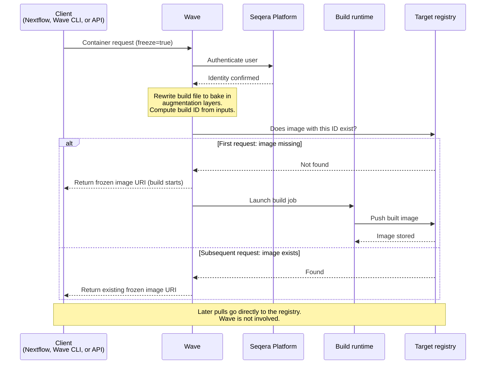

Freeze mode produces a permanent container image in a registry you control. Wave builds the image, pushes it to the target registry, and returns a stable URI. The URI carries no Wave access token and does not expire. Subsequent pulls go directly to the registry and bypass Wave.

At build time, Wave rewrites the build file to bake augmentation layers directly into the image rather than injecting them at pull time. Augmentation layers include container config files, environment variables, and entrypoints. Freeze requests must specify a target build repository, either supplied by the client or configured as a default. Singularity (SIF) images always use freeze mode because the monolithic format does not support dynamic layer injection.

[Seqera Containers](../seqera-containers/index.mdx) is a managed application of freeze mode. The community service uses freeze internally to push Conda and PyPI images to `community.wave.seqera.io`.

:::tip
To copy an existing image to another registry without modifying it, use [container mirroring](./mirroring.mdx). Mirroring copies the image byte-for-byte and preserves the original manifest, name, and digest. Freeze returns a new, Wave-built image under a name you choose.
:::

## Use cases

Use cases for container freeze include:

- **Reproducibility and collaboration**: Finalized containers reside in a permanent registry. Collaborators and future workflows use the exact same environment, without reliance on ephemeral builds.
- **Reusability**: Central storage of pre-built images avoids repeated builds. Overhead is reduced and pipeline execution time is reduced.
- **Archiving for compliance**: Store containers permanently for auditing. Keep a traceable, unaltered record of the environment used for an analysis.
- **Portability**: Deliver images to the same region or cloud account where compute runs. Pull latency and egress costs are reduced.
- **Air-gapped or restricted environments**: Compute targets that cannot reach Wave at pull time can still use frozen images, because the image is self-contained in the target registry.

## How it works

The freeze flow involves the client, Wave, Seqera Platform, the build runtime, and the target registry:

1. The client (Nextflow, the Wave CLI, or the Wave API) submits a container request with:
    - The user's Seqera Platform identity.
    - The base image to augment, or instructions to build a container.
    - The container extension configuration, which can be a custom payload, one or more extension layers, or additional images.
    - The target repository for the new container.
2. Wave validates the request and authorizes the user against the Seqera Platform service.
3. Wave rewrites the Dockerfile (or Singularity definition) to bake augmentation layers into the build.
4. Wave computes a build ID from the rewritten build inputs and checks whether the image already exists in the target registry.
5. If the image is missing, Wave launches a build job and pushes the result to the target registry.
6. Wave responds with the frozen image name, for example `your.registry.com/some/image/build:1a2b3c4d5e6f7890`.

Frozen images are regular container builds with no special formats or restrictions. Wave assigns each image a unique ID derived from a hash of the container file, any package dependencies, the target platform (AMD64 or ARM64), and the target repository name. A second request for the same container produces the same ID, so Wave skips the build and returns the existing image. Images reside in the repository you selected. Wave does not cache them locally unless you configure a cache repository. Images are stored permanently unless the repository owner deletes them.
