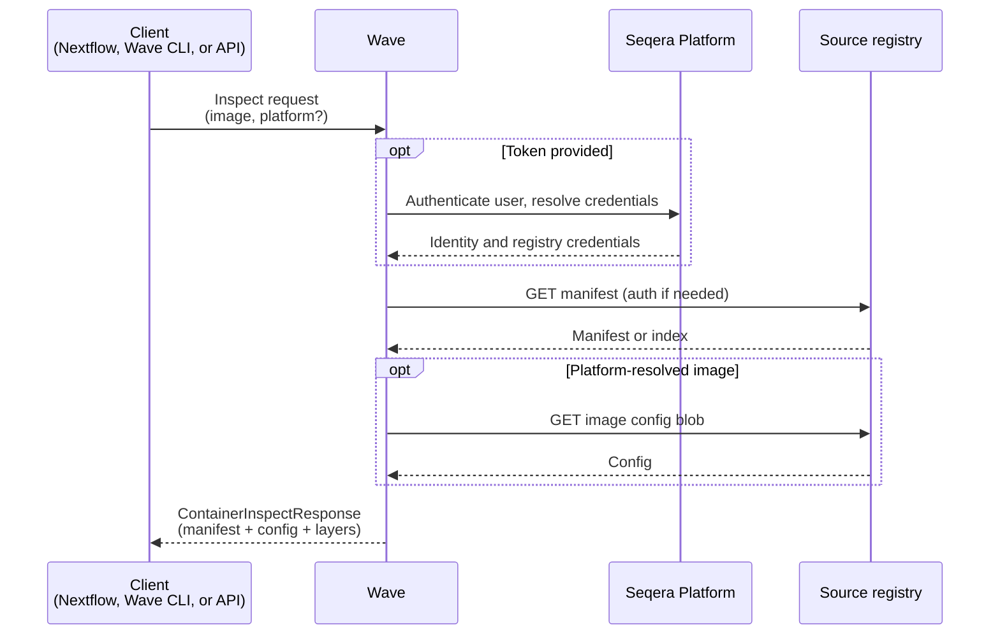

Container inspection returns a container image's metadata. The response includes the manifest, image config, layer digests, and platform-specific digest. A single request provides the information needed to decide whether to pull the image, trigger an augmentation, or record the image in an audit trail.

With a Seqera Platform access token, Wave resolves matching registry credentials from the user's workspace. Without a token, Wave inspects public images anonymously. Users never handle registry tokens directly.

Inspection issues no tokens, pulls no layers, and runs independently of container builds and scans.

## Use cases

Use cases for container inspection include:

- **Pre-flight validation**: Confirm a referenced image exists, matches the expected architecture, and resolves to the expected digest before a pipeline runs.
- **CI and governance checks**: Block pipeline submissions that reference images outside an approved registry. Enforce that all images are pinned by digest.
- **Audit and compliance**: Record the exact manifest digest used in a pipeline run for reproducibility and traceability.
- **Private registry reachability**: Verify that Seqera Platform credentials can pull from a private registry before committing to a workload.

## How it works

The inspection flow runs as follows:

1. A client (Nextflow, the Wave CLI, or the Wave API) sends an inspect request with the image URI. The `platform` parameter is optional. It must be a single value such as `linux/amd64` or `linux/arm64`. Multi-platform values are rejected.
2. Wave authenticates the caller. If the request includes a Seqera Platform access token, Wave verifies it and resolves the user's workspace credentials. Requests without a token proceed anonymously.
3. Wave queries the source registry. For platform-resolved images Wave also fetches the image config blob. For multi-architecture requests with no platform specified, Wave returns the manifest index without descending into a platform manifest.
4. Wave returns a single response containing either a `container` spec (for a resolved platform-specific image) or an `index` spec (for a multi-architecture image when no platform is specified). The response includes the registry, image name, reference, manifest digest, layer digests and sizes, and the image config.

