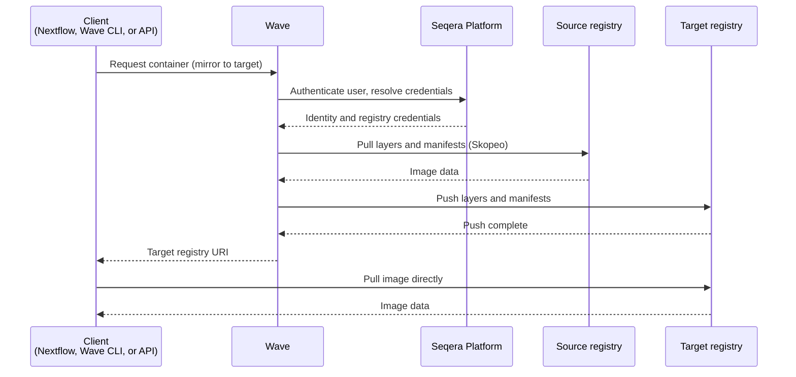

Storing container images in a registry you control improves security, supports policy compliance, and gives faster access. Wave mirroring automates the copy. Wave pulls the image from its source and pushes it to your registry on demand. The tag and digest stay the same, so only the registry hostname changes.

Wave runs the copy with Skopeo. Mirror operations run asynchronously. Tools that pin the image by digest continue to work against the mirrored copy.

:::tip
To produce a new, Wave-built image and push it under a name you choose, use [container freeze](./container-freezes.mdx). Freeze returns a new image with a build-hash-derived tag. Mirroring copies the existing image byte-for-byte and preserves its tag and digest.
:::

## Use cases

Use cases for container mirroring include:

- **Region-specific deployments**: Place containers in the right geographic region to meet data residency requirements or cut latency.
- **Enhanced security**: Serve images from a registry behind a firewall or inside tight networking controls.
- **Cost and performance**: Pull from a cloud-native registry co-located with compute. This reduces egress costs compared with pulls from remote registries.
- **Multi-cloud pipelines**: Deploy workflows across AWS, Google Cloud, and Azure. Each cloud pulls from its local registry.
- **Mitigating upstream rate limits**: Mirror a public image once and serve many pulls from your own registry.

## How it works

The mirror flow runs as follows:

1. A client (Nextflow, the Wave CLI, or the Wave API) requests a container and asks for mirroring to a target registry.
2. Wave authenticates the caller against Seqera Platform. Mirror requests require a Seqera Platform access token. Seqera Platform supplies the registry credentials Wave uses to pull from the source and push to the target.
3. Wave validates the request. The source and target registry hosts must differ. The request must use the v2 API.
4. If the target image is already mirrored or in progress, Wave returns the target URI straight away. Otherwise, Wave launches a Skopeo copy job. The job pulls every layer and manifest from the source and pushes them to the target.
5. Wave returns the target registry URI to the client. The client pulls the image directly from the target registry with no further involvement from Wave.

