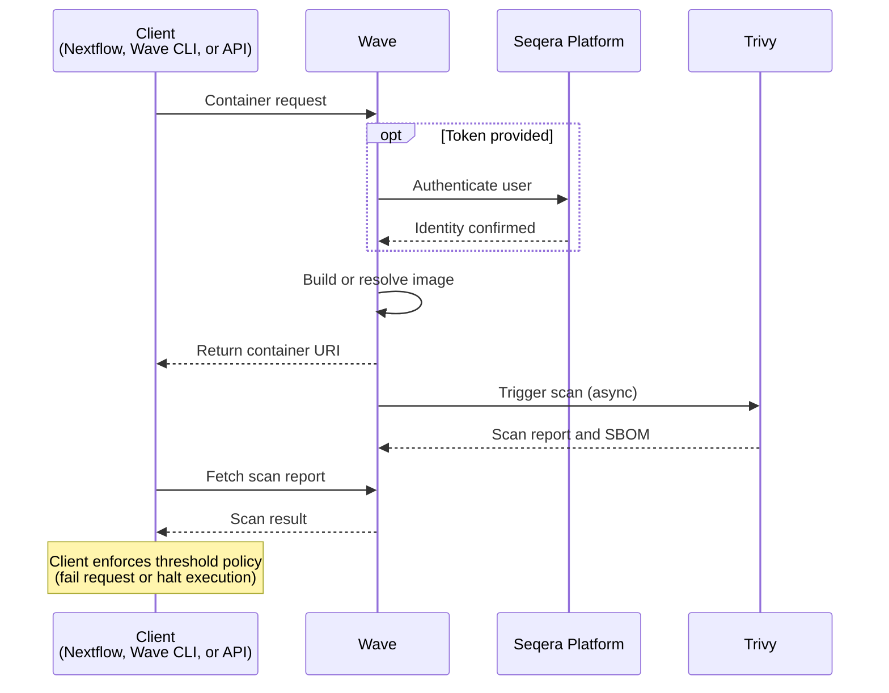

Security scanning identifies known vulnerabilities and outdated packages before a container runs. Wave runs the scans with [Trivy](https://trivy.dev/) and can also produce a software bill of materials (SBOM) in SPDX format.

Wave scans both Wave-built images and external images served through Wave. Scans run asynchronously, so container requests do not block on scan completion. Scans can be requested from Nextflow, the Wave CLI, or the Wave API. Seqera Containers runs scans internally on every image it builds and exposes results through the build details view.

Wave also scans Nextflow plugin artifacts hosted in OCI registries. Plugin scans use [ORAS](https://oras.land/) to retrieve the artifact and Trivy's filesystem scanner to detect vulnerabilities in the bundled JARs and dependencies.

Wave stores scan results and exposes them through the Wave API. The Seqera Platform Containers UI surfaces a link to the Wave scan report for each request. Wave clients can fail the container request or halt pipeline execution if vulnerabilities exceed a client-configured threshold. Wave returns the vulnerability data; the client enforces the policy. In Nextflow, configure the threshold with `wave.scan.allowedLevels`. Accepted values are `low`, `medium`, `high`, and `critical`.

## Use cases

Use cases for security scanning include:

- **Secure workflows**: Prevent vulnerable containers from running so that workloads meet internal security and compliance requirements.
- **Audit and compliance**: Generate vulnerability reports and SBOMs as compliance evidence.
- **Dynamic environments**: Use containers from varied sources and maintain a consistent security bar. Block or halt execution when new vulnerabilities are identified in an image that is in use.
- **SBOM generation**: Attach an SPDX SBOM to each build for provenance and supply-chain visibility.

## How it works

The scan flow involves the client, Wave, Seqera Platform, and the Trivy scanner:

1. A Wave client submits a container request. Wave clients include Nextflow, the Wave CLI, and the Wave API.
2. Wave authenticates the caller. If the request includes a Seqera Platform access token, Wave verifies it. If the Wave deployment permits anonymous access and no token is supplied, Wave processes the request anonymously.
3. Wave builds or resolves the requested image and returns a container URI to the client.
4. Wave triggers an asynchronous Trivy scan of the image.
5. When the scan completes, Trivy returns a vulnerability report and SBOM to Wave. Wave stores the results and exposes them through the Wave API. The Seqera Platform Containers UI links to the report.
6. The client fetches the scan result through the Wave API. If vulnerabilities exceed the client-configured threshold, the client fails the container request or halts pipeline execution.

Scan results are available through the Wave API once the scan completes. Results include the vulnerability report, the SPDX SBOM, and scan logs.

Scans expire after one week. If a container is accessed again after seven days, Wave re-runs the scan.

Security scanning is not available in Wave Lite — see the [feature matrix](./index.mdx) for the capabilities supported by each deployment.
