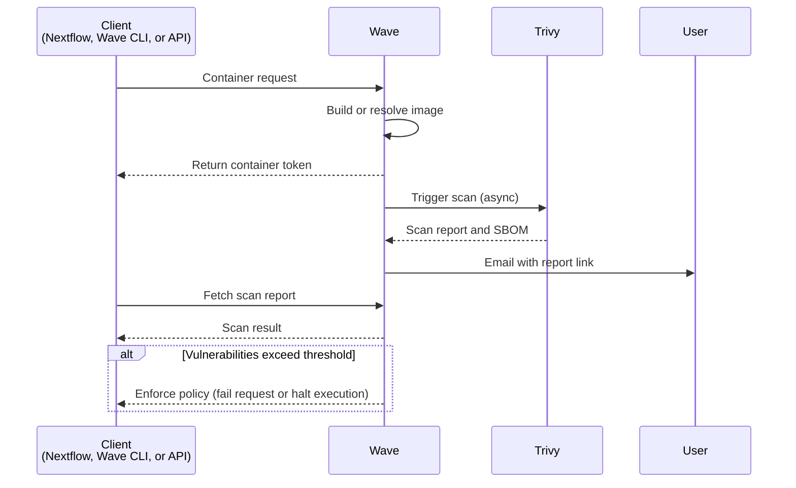

Security scanning identifies known vulnerabilities and outdated packages before a container runs. Wave uses the [Trivy](https://trivy.dev/) scanner. Wave can also produce a software bill of materials (SBOM) in SPDX format.

Wave scans both Wave-built images and external images served through Wave. Scans run asynchronously. Container requests do not block on scan completion unless explicitly configured. Scans can be requested from Nextflow, the Wave CLI, or the Wave API. Seqera Containers runs scans internally on every image it builds and exposes results through the build details view.

The user who requested the image receives an email with a link to the security report. Wave clients can be configured to fail container requests, or halt pipeline execution, when vulnerabilities exceed a configured threshold.

## Use cases

Use cases for security scanning include:

- **Secure workflows**: Prevent vulnerable containers from running so that workloads meet internal security and compliance requirements.
- **Audit and compliance**: Generate vulnerability reports and SBOMs as compliance evidence.
- **Dynamic environments**: Use containers from varied sources and maintain a consistent security bar. Block or halt execution when new vulnerabilities are identified in an image that is in use.
- **SBOM generation**: Attach an SPDX SBOM to each build for provenance and supply-chain visibility.

## How it works

The scan flow involves the client, Wave, the Trivy scanner, and the image requester:

1. A Wave client submits a container request. Wave clients include Nextflow, the Wave CLI, and the Wave API.
2. Wave builds or resolves the requested image and returns a container URI to the client.
3. Wave triggers an asynchronous Trivy scan of the image.
4. When the scan completes, Trivy returns a vulnerability report and SBOM to Wave. The image requester receives an email with a link to the report.
5. If vulnerabilities exceed the configured threshold, the Wave client enforces the policy by failing the container request or halting pipeline execution.

Scan results are available through the Wave API once the scan completes. Results include the vulnerability report, the SPDX SBOM, and scan logs.

Scans expire after one week. If a container is accessed again after seven days, Wave re-runs the scan.
