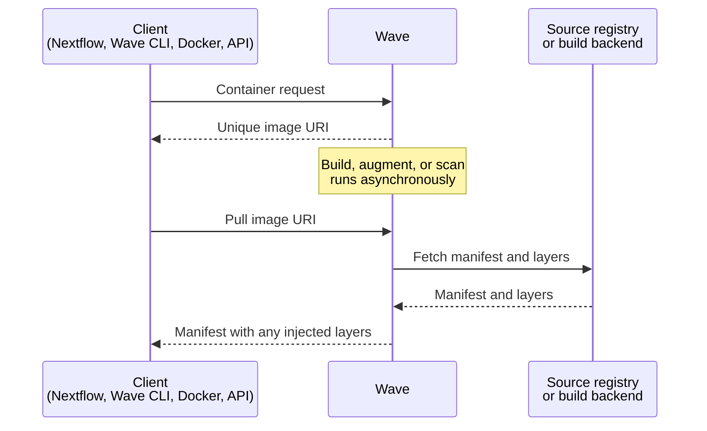

Wave builds, augments, and serves container images on demand. Clients submit a request that references an existing image or supplies build instructions. Wave returns a URI that any OCI-compliant container runtime can pull from. Wave implements the Docker Registry v2 API and acts as a fully OCI-compliant registry.

## The request lifecycle

Wave clients such as Nextflow and the Wave CLI call the container-provisioning API. Wave authenticates the caller against Seqera Platform when a token is supplied and returns a unique image URI immediately. Builds, augmentations, and scans run asynchronously in the background.

When the runtime pulls the URI, Wave holds the connection open until any in-progress work completes. Wave then serves a manifest that combines base layers from the source registry with any layers it injects. Containers behave as if they came from a standard registry, so existing tooling needs no change.

## Serving image layers

Wave acts as an HTTP proxy during a pull. Most public registries (Docker Hub, Quay.io, AWS ECR, Google Artifact Registry) host metadata themselves and offload binary storage to services such as AWS S3, AWS CloudFront, or Cloudflare. Wave returns HTTP redirects in those cases and the runtime pulls the bytes directly from the storage service.

Self-hosted or custom registries sometimes serve layer binaries directly. When Wave fronts such a registry it caches the binaries in object storage and serves them through a CDN. The hosted Wave service uses Cloudflare, the [same approach Docker Hub uses](https://www.cloudflare.com/case-studies/docker/).
