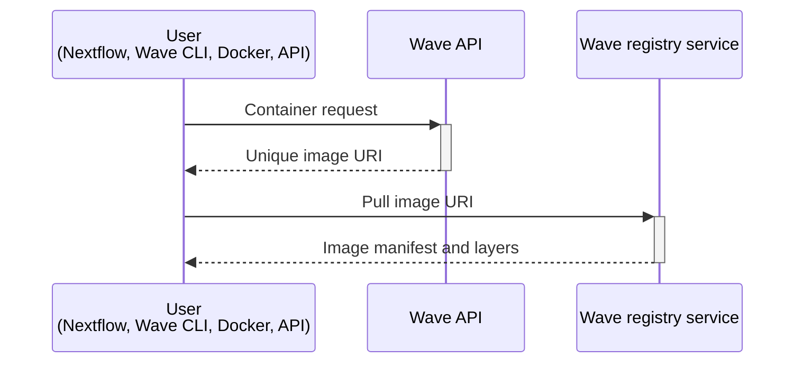

Wave builds, augments, and serves container images on demand. Clients submit a request — referencing an existing image or supplying build instructions — and Wave returns a URI that any OCI-compliant container runtime can pull from.

## Requesting and serving images

Wave clients such as Nextflow and the Wave CLI call the Wave container-provisioning API. A request can reference an existing container image or supply build instructions. For example, a Dockerfile, Singularity recipe, Conda packages, a Conda environment file, or a list of CRAN packages.

When a client makes a request:

- Wave returns a unique URI that standard container clients can use to pull the image.
- Wave processes the request asynchronously and builds or augments the image as required.

Wave implements the Docker Registry v2 API and acts as a fully OCI-compliant container registry. Once a container is requested, Wave manages the pull and delivery:

- Wave holds the client connection while builds, augmentations, and scans complete.
- Wave retrieves base layers from the source registry and serves added or modified layers itself.
- Containers behave as if they originated from a standard registry.
- Wave integrates with existing workflows and tooling.

Wave modifies images dynamically rather than rebuilding them. This saves time and reduces resource consumption.



## Serving image layers

Wave acts as an HTTP proxy between the container client and the source registry during image pulls. Most public registries, such as Docker.io, Quay.io, and AWS ECR, store only metadata and offload image binary storage to services such as AWS S3, AWS CloudFront, or Cloudflare. In those cases, Wave does not handle the binary layer responses itself. Wave returns HTTP redirects and the client pulls directly from the storage service.

Self-hosted or custom registries sometimes serve image binaries directly rather than redirecting to a CDN. When Wave serves images from such a registry, it caches the binaries in object storage and fronts them with a CDN. The hosted Wave service uses Cloudflare, the [same approach used by Docker Hub](https://www.cloudflare.com/case-studies/docker/).

## Wave image URIs

Wave returns one of two URI formats. Ephemeral URIs are short-lived and served by Wave. Stable URIs point directly at a registry of your choice and persist indefinitely.

### Ephemeral containers

By default, Wave returns ephemeral containers. Ephemeral URIs are designed for single use and expire after 36 hours. Ephemeral image names use the following format:

```
wave.seqera.io/wt/<access-token>/wave/build:<checksum>
```

In the example:

- `<access-token>` is a 12-character unique access token. It acts as a one-time key that unlocks retrieval using credentials stored in Seqera Platform.
- `<checksum>` is a 16-character unique build identifier that ensures correct caching by the Wave backend and by the client. The checksum changes whenever the build recipe or source changes.

### Stable containers

Wave can persist, or freeze, a container build to a registry. In that case Wave returns the registry URI in place of an ephemeral URI. Stable URIs include no access token, do not expire, and point directly at the target registry, so the client pulls from that registry without involving Wave. Stable image names use the following format:

```
your.registry.com/library/<image-name>:<checksum>
```

In the example:

- `<image-name>` is the image name in your target registry, set when you configure freeze.
- `<checksum>` is the same 16-character build hash used by ephemeral images. It ties the image to its build inputs, providing reproducible, cache-friendly identifiers.

## Next steps

To start using Wave:

- Browse [Features](./features/index.mdx) for the full capability set.
- Follow the [Tutorials](./tutorials/index.mdx) to provision your first container.
