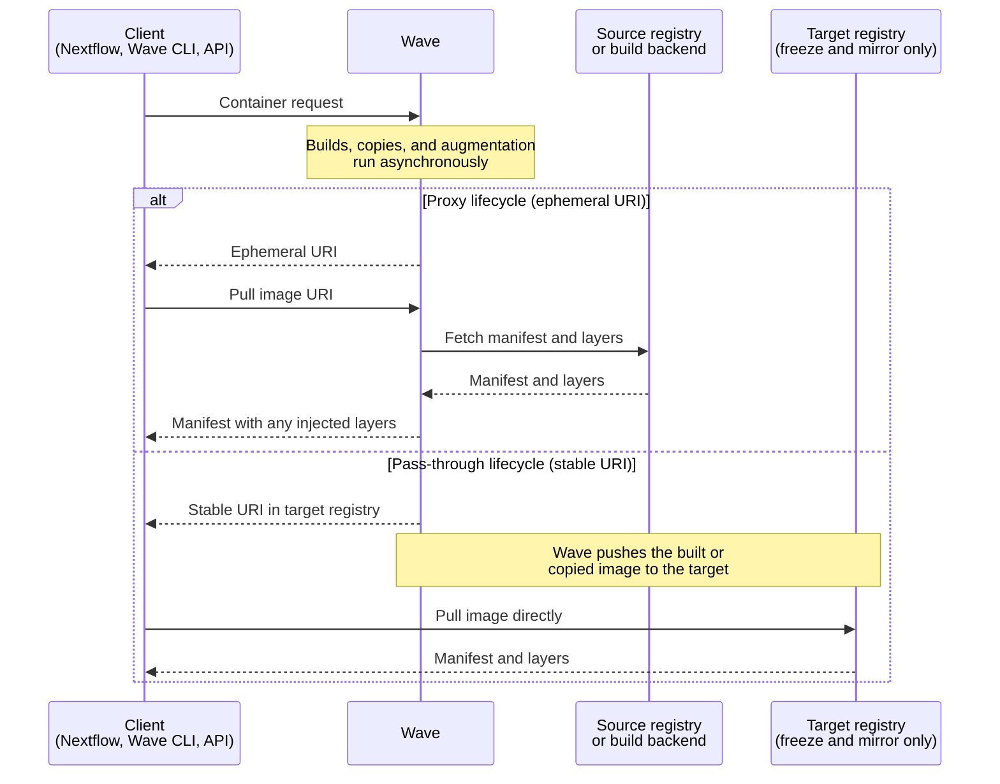

Wave builds, augments, and serves container images on demand. Clients submit a request that references an existing image or supplies build instructions. Wave returns an image URI that any standard container runtime can pull. Wave implements the Docker Registry v2 API and serves OCI-compatible manifests, so existing tooling works unchanged.

## Request lifecycles

Wave delivers images two ways. Most requests use a proxy lifecycle. Freeze and mirror use a pass-through lifecycle. Inspection and scanning fall outside both patterns.

For details on each capability, see [Features](./features/index.mdx).

### Proxy lifecycle

The proxy lifecycle covers augmentation, private registry authentication, and default on-demand builds. Wave stays in the pull path and the runtime fetches the image through Wave.

A Wave client (Nextflow, the Wave CLI, or any caller of the Wave API) submits a container request. Wave authenticates the caller against Seqera Platform when you supply a token. Wave returns an ephemeral image URI immediately. Builds and augmentation work run asynchronously in the background.

When the runtime pulls the URI, Wave holds the connection open until any in-progress work completes. Wave then serves the manifest. For augmentation, the manifest combines base layers from the source registry with the layers Wave injects. For builds, Wave proxies the manifest of the freshly built image.

### Pass-through lifecycle

The pass-through lifecycle covers container freeze and container mirroring. Wave returns a stable URI in a registry you control and stays out of the pull path.

Wave runs the build or copy in the background and pushes the result to your target registry. The runtime pulls from that registry directly. Pulls before the underlying job finishes fail rather than block.

### Inspection and scanning

Inspection is a synchronous request. Wave queries the source registry and returns metadata in one round trip. There is no URI and no pull phase.

Security scanning runs as a parallel asynchronous track. Scans do not block pulls. Clients fetch scan results through a separate API and can abort based on results.



## Image URIs

Wave returns one of two URI formats. Both embed a content-based build identifier, so identical inputs always resolve to the same URI and reuse the cached image.

### Ephemeral URIs

Augmentation and default on-demand build requests return ephemeral URIs. They suit single-use pipeline tasks and expire 36 hours after the request is submitted. Ephemeral image names take this form:

```
wave.seqera.io/wt/<access-token>/<image-path>:<tag>
```

The `<image-path>:<tag>` segment depends on the request. Builds use `wave/build:<checksum>`. Augmentation requests preserve the source image path, for example `library/alpine:latest`.

In this example:

- `<access-token>` is a 12-character random key, valid for the request lifetime of around 36 hours. Wave uses it to authorize the pull and to look up the registry credentials stored in Seqera Platform.
- `<checksum>` is a 16-character build identifier derived from the request inputs. Inputs include the container file, the package recipe, the target platform, the target repository, the build context, and the container config.

### Stable URIs

Freeze and mirror return URIs that point at a registry you control. Stable URIs carry no access token, never expire, and route the runtime to the target registry without involving Wave. Stable image names take this form:

```
your.registry.com/<image-path>:<checksum>
```

In this example:

- `<image-path>` is the path in your target registry, set in `wave.build.repository`. You choose the path.
- `<checksum>` is the same 16-character build identifier used by ephemeral URIs.

## Serving image layers

In the proxy lifecycle, Wave acts as an HTTP proxy during a pull. Wave delivers manifests itself. Layer blobs follow one of two paths.

Most public registries (Docker Hub, Quay.io, AWS ECR, Google Artifact Registry) host metadata themselves and offload binary storage to services such as AWS S3, AWS CloudFront, or Cloudflare. Wave returns HTTP redirects for layer requests. The runtime pulls the bytes directly from the storage service.

Self-hosted or custom registries sometimes serve layer binaries inline. When Wave fronts such a registry, it caches the binaries in object storage and serves them through a CDN. The hosted Wave service uses Cloudflare, the [same approach Docker Hub uses](https://www.cloudflare.com/case-studies/docker/).

The pass-through lifecycle has no proxy step. Stable URIs send the runtime to your target registry, which serves manifests and layers itself.

## API limits

Wave applies rate limits to every API request. Nextflow and the Wave CLI both call the Wave API on your behalf, meaning a single pipeline run can consume many requests. A Seqera Platform access token raises the limits:

If an access token is provided, the following rate limits apply:

- 250 container builds per hour
- 2,000 container pulls per minute

If an access token isn't provided, the following rate limits apply:

- 25 container builds per day
- 100 container pulls per hour

Only the manifest request counts as a pull. Layer and blob fetches do not count, so a 100-layer image still costs one pull.

See [API limits](./api.md#api-limits) for more information.
