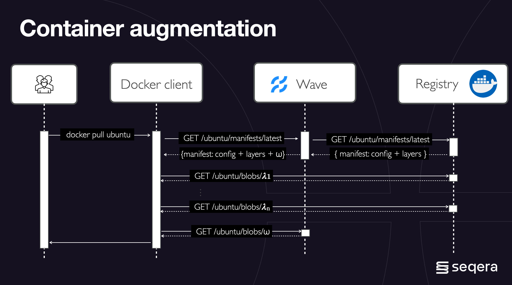

Containers are an essential part of data analysis in the cloud. Building and delivering optimized, context-aware container images slows down development.

Wave is a container provisioning service designed for use with data analysis applications such as Nextflow.

It allows for the on-demand assembly, augmentation, and deployment of containerized images based on task requirements.

The Wave container service itself is not a container registry. All containers builds are stored in a Seqera-hosted image registry for a limited time or frozen to a user-specified container registry.

## Features

### Private container registries

Container registry authentication is the new norm. Yet when it comes to authenticating against cloud-specific container registries, the process is hardly hassle free.
Wave integrates with Seqera Platform credentials management enabling seamless access and publishing to private registries.

### Augment existing containers

Regulatory and security requirements sometimes dictate specific container images, but additional context is often needed.
Wave enables any existing container to be extended without rebuilding it. Developers can add user-provided content such as custom scripts and logging agents, providing greater flexibility in the container’s configuration.

Wave offers a flexible approach to container image management. It allows you to dynamically add custom layers to existing docker images, creating new images tailored to your specific needs.

#### An example of Wave augmentation

Imagine you have a base Ubuntu image in a container registry. Wave acts as a proxy between your docker client and the registry. When you request an augmented image, Wave intercepts the process.

1. Base image layers download: The Docker client downloads the standard Ubuntu layers from the registry.
2. Custom layer injection: Wave injects your custom layer, denoted by "ω", which could represent application code, libraries, configurations etc.
3. New image creation: Wave combines the downloaded Ubuntu layers with your custom layer, effectively creating a new image on the fly.

#### Benefits of Wave augmentation

1. Streamlined workflows: Wave simplifies your workflow by eliminating the need to manually build and manage custom images.
2. Flexibility: You can easily modify the custom layer for different use cases, allowing for greater adaptability.

### Conda based containers

Package management systems such as Conda and Bioconda simplify the installation of scientific software. However, there’s considerable friction when it comes to using those tools to deploy pipelines in cloud environments.
Wave enables dynamic provisioning of container images from any Conda or Bioconda recipe. Just declare the Conda packages in your Nextflow pipeline and Wave will assemble the required container.

### Deploying containers across multi-clouds

Cloud vendors provide integrated container registries, providing better performance and cost-efficiency than central, remote registries.
This requires mirroring container collections across multiple accounts, regions, and cloud providers when deploying multi-cloud pipelines.
Wave streamlines this process by provisioning the required containers to the target registry on-demand during the pipeline executions.

### Container security scanning

Builds for OCI-compliant container images are automatically scanned for known security vulnerabilities. Wave conducts a vulnerability scan using the [Trivy](https://trivy.dev/) security scanner. Seqera Platform customers receive an email that includes a link to the security report listing any vulnerabilities discovered.

### Optimize workloads for specific architectures

Modern data pipelines can be deployed across different data centers having different hardware architectures. e.g., amd64, arm64, and others. This requires curating different collections of containers for each architecture.
Wave allows for the on-demand provisioning of containers, depending on the target execution platform (in development).

### Near caching

The deployment of production pipelines at scale can require the use of multiple cloud regions to enable efficient resource allocation.
However, this can result in an increased overhead when pulling container images from a central container registry. Wave allows the transparent caching of container images in the same region where computation occurs, reducing data transfer costs and time (in development).
