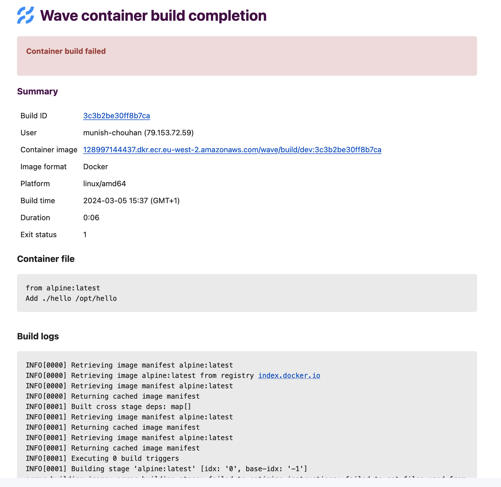

## Troubleshoot guide

1. How to troubleshoot container build failure?

If your container build fails, you can check the build details by checking the logs in build details email as shown in below screenshot.

#### email screenshot:


If there is nothing conclusive in logs, you can check the exit status, e.g. if it is 137 that means out of memory error.
Wave run build process in Kubernetes pod, you can check this [link](https://komodor.com/learn/exit-codes-in-containers-and-kubernetes-the-complete-guide/) for more details on exit codes.

2. How to solve buildkit  error, while running wave build on Docker desktop in mac os?

#### error:
```
could not connect to unix:///run/user/1000/buildkit/buildkitd.sock after 10 trials
========== log ==========
[rootlesskit:parent] error: failed to start the child: fork/exec /proc/self/exe: invalid argument
sh: can't kill pid 14: No such process
```

#### Solution:
- In case of wave cli use `--platform linux/arm64` flag with wave build command.
- In case of API call use `containerPlatform: linux/arm64` in the request body.

## Registry push and authentication failures

When Wave cannot push a built or mirrored image, or cannot authenticate to a registry, the failure usually matches one of these symptoms:

- **No credentials match the target host.** Wave returns an authentication error at token-request time, before BuildKit or Skopeo launches. This is the fastest failure to diagnose. Confirm you configured credentials for the target registry.
- **The repository does not exist and the registry requires pre-creation.** The push fails with `403 Forbidden` or `404 Not Found` partway through the layer upload, often after an initial `HEAD` succeeds but the final manifest `PUT` fails. Pre-create the repository. For per-registry rules, see [per-registry pre-creation rules](install/aws-build.md#create-the-ecr-repositories).
- **Credentials exist but lack push scope.** The push typically returns a `403` on the final manifest `PUT` even though layer uploads appear to work. Check the credential's scope for `push`, `write`, or `deploy` permission.
- **The repository key is missing from the path (JFrog Artifactory).** The push fails with `404`. Confirm the repository key is the first path segment after the host, for example `artifactory.example.com/docker-local/...`.
- **The registry exists but the configured AWS credentials or role target the wrong region or account.** For ECR, a misaligned `aws.region` or jump-role configuration produces STS `AccessDenied` errors in the Wave service logs. These errors appear when Wave exchanges the configured credentials for an ECR auth token, before the build pod launches.

