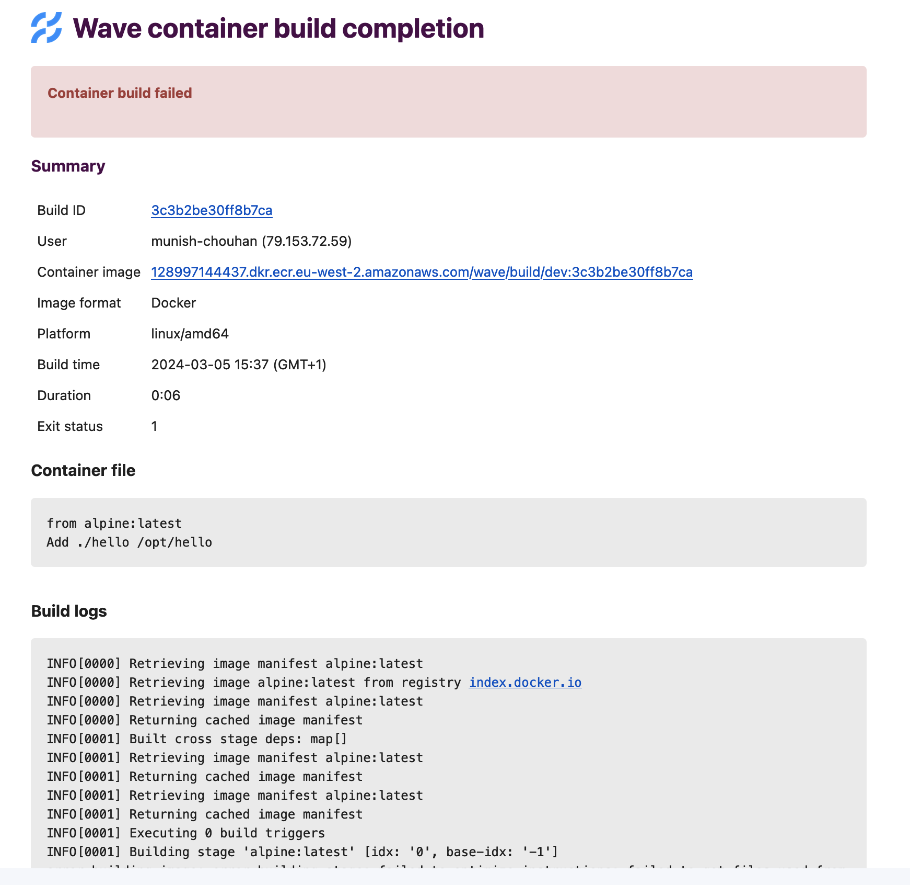

## Troubleshoot guide

1. How to troubleshoot container build failure?

If your container build fails, you can check the build details by checking the logs in build details email as shown in below screenshot.

#### email screenshot:


If there is nothing conclusive in logs, you can check the exit status, e.g. if it is 137 that means out of memory error.
Wave run build process in kubernetes pod, you can check this [link](https://komodor.com/learn/exit-codes-in-containers-and-kubernetes-the-complete-guide/) for more details on exit codes.

2. How to solve buildkit  error, while running wave build on docker desktop?

#### error:
```
could not connect to unix:///run/user/1000/buildkit/buildkitd.sock after 10 trials
========== log ==========
[rootlesskit:parent] error: failed to start the child: fork/exec /proc/self/exe: invalid argument
sh: can't kill pid 14: No such process
```

#### Solution:
- Open Docker Desktop.
- Go to Preferences > Docker Engine.
- Add "features": { "buildkit": true } to the JSON configuration.
- Click "Apply & Restart" to save the changes and restart Docker.

