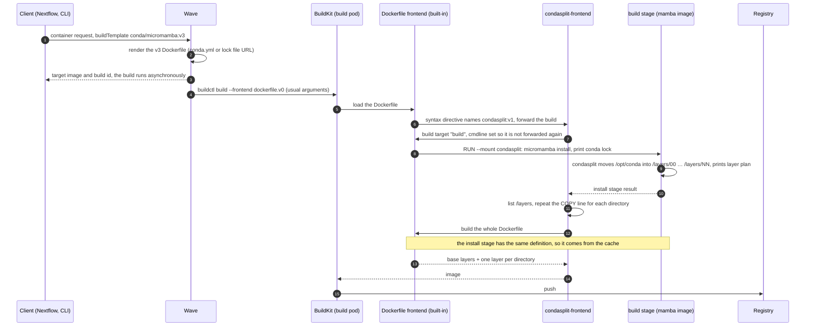

# Layered Conda Builds (`conda/micromamba:v3`)

**Branch**: `002-conda-micromamba-v3-layers` · **PR**: [#1146](https://github.com/seqeralabs/wave/pull/1146) · **Created**: 2026-09-30
**Status**: Implemented, pending staging validation and the production image release
**Scope**: Wave service (Cloud and Enterprise), Docker (OCI) images only. `nextflow` and `wave-cli` pass `buildTemplate` through as free text and need help-text updates only.
**ADR**: [`adr/20260930-conda-layered-builds.md`](../../adr/20260930-conda-layered-builds.md)

## Summary

`conda/micromamba:v3` is a new, opt-in build template. It installs the Conda environment exactly like `conda/micromamba:v2`, then ships it as several image layers grouped by package, each at most 500 MB before compression, instead of one multi-GB layer. Two small Go programs make this work. Both ship in one tool image, `wave/condasplit`:

- **`condasplit`** runs inside the install step and moves the installed files into one directory per layer.
- **`condasplit-frontend`** is a BuildKit frontend. It turns the template's single `COPY` line into one `COPY`, and so one image layer, per directory.

Existing templates, the default template and all existing container ids are unchanged.

## Problem

Every Conda template ships the environment as a single layer. For the reference environment (gatk4 4.6.2.0 + gcnvkernel 0.9, 323 packages, linux/amd64) that layer is 1,988 MB compressed. This causes three problems:

1. **Size limits (main driver).** Some registries, proxies and CDN caches reject or don't cache blobs larger than 512 MB.
2. **Pull speed.** Runtimes download and unpack a single layer over one connection.
3. **Build export.** BuildKit compresses one layer per core, so one big layer means one slow export: 125 s against 19 s layered.

**Goals.**
- Conda layers under 512 MB compressed.
- Large packages in their own layer.
- The same files as v2, minus the unused package cache `/opt/conda/pkgs`.
- No change to existing templates or container ids.
- No new services, API fields or persistence.

**Non-goals.**
- Singularity: a SIF image is one squashfs file, so v3 rejects it with HTTP 400.
- Changing v1, v2 or pixi.
- Making v3 the default.
- Sharing package layers across images.
- Showing the layer plan in the UI.

## How a v3 build works

| Component | Role |
|---|---|
| Wave | Renders the Dockerfile from the v3 template and starts the build with the usual `buildctl` arguments |
| v3 Dockerfile | Two stages. The first line `# syntax=<condasplit image>` selects the frontend. The `build` stage installs the environment and runs `condasplit`. The `prod` stage has one `COPY --link --from=build /layers/NN/ /` line |
| `condasplit-frontend` | The image's entrypoint. BuildKit runs it for the `# syntax=` directive. It builds the `build` stage, lists `/layers`, repeats the `COPY` line for each directory and builds the image. It delegates both builds to the built-in Dockerfile frontend |
| `condasplit` | Mounted read-only into the install `RUN`. It moves `/opt/conda` (except `pkgs/`) into `/layers/00`, `/layers/01`, …, each rooted at `/`, and prints the layer plan |
| BuildKit | Unchanged, rootless `v0.25.2` in a Kubernetes pod. It pulls the tool image once as the frontend and once for the mount |



**The template** (`src/main/resources/templates/conda-micromamba-v3/dockerfile-conda-file.txt`) is v2's install step plus the frontend directive, the tool call and a new final stage:

```dockerfile
# syntax={{layers_image}}
FROM {{mamba_image}} AS build
USER root
{{conda_file_add}}
# ... same `which` link, install, CUDA retry, base packages, clean and conda lock as v2 ...
RUN --mount=type=bind,from={{layers_image}},source=/,target=/opt/wave-tools \
    micromamba install -y -n base {{conda_file_opts}} ... \
    && /opt/wave-tools/condasplit --src /opt/conda --out /layers \
        --slots 32 --max-layer-size 500000000 --own-layer-size 50000000 --exclude pkgs

FROM {{base_image}} AS prod
ARG MAMBA_ROOT_PREFIX="/opt/conda"
ENV MAMBA_ROOT_PREFIX=$MAMBA_ROOT_PREFIX
# the condasplit frontend repeats this line for each layer directory: /layers/00, /layers/01, ...
COPY --link --from=build /layers/NN/ /
USER root
ENV PATH="$MAMBA_ROOT_PREFIX/bin:$PATH"
```

| Input | `{{conda_file_add}}` | `{{conda_file_opts}}` |
|---|---|---|
| Conda file, or packages turned into a `conda.yml` | `COPY --chown=$MAMBA_USER:$MAMBA_USER conda.yml /tmp/conda.yml` | `-f /tmp/conda.yml` |
| Lock file URL | `ADD <url> /tmp/conda-lock/<name>` | `-c <channel> … -f /tmp/conda-lock/<name>` |

`{{layers_image}}` is the `wave.build.condasplit-image` setting. The image has the base image layers, one layer per directory, and one per custom `commands` entry. Built without the frontend, the Dockerfile fails on the missing `/layers/NN`.

## Key decisions

**D1. A new template version.** The container id hashes the generated Dockerfile, so changing v2 would change every existing id and trigger rebuilds. v3 is opt-in, and `defaultTemplate()` still returns v2. The tool parameters are literal in the template, so tuning them means a new template version.

**D2. Split inside the install step, by moving files.** `condasplit` runs in the same `RUN` as `micromamba install`, so every installed file is in the same writable layer:
- `rename()` only rewrites directory entries, which takes seconds (2.8 s for 88,231 files).
- Build disk use stays at v2's level, since nothing is copied.
- Hardlinks, owners, modes and times survive, because a moved file is the same file.

A final check fails the build if anything but directories and `pkgs/` is left behind. The proof of concept copied files into a separate stage instead, which doubled the environment on disk and in the build cache.

**D3. Grouping by package** (the proof of concept's rules):
- **Ownership.** Paths are assigned to packages from the `files` list of each `conda-meta/<dist>.json`, first claim wins. Unclaimed files go to a trailing leftovers layer.
- **Hardlinks.** All paths sharing an inode form one unit that is never split.
- **Own layers.** A package of at least 50 MB gets its own layer. A package over 500 MB is cut into 500 MB chunks.
- **Shared layers.** Smaller packages are packed first-fit-decreasing into layers of at most 500 MB.
- **Oversized files.** A single file over 500 MB gets a layer to itself, with a warning.
- **Too many layers.** Above 32 layers, the two smallest are merged, with a warning.

32 layers hold about 16 GB before compression, and the image stays well under the ~125-layer overlay limit.

**D4. Drop `/opt/conda/pkgs`.** `micromamba clean -a` leaves extracted packages there, hardlinked to the environment. Keeping them doubles the content, and no runtime needs them.

**D5. `condasplit` in Go, standard library only, mounted from a `FROM scratch` image.** A static binary runs in any mamba image; the default `mambaorg/micromamba:2-amazon2023` lacks `find` and `tar`, which rules out shell. `RUN --mount=type=bind,from=<image>` puts it in the build step without copying it into any stage, so it is in neither the image nor the build cache. Each platform builds on its own architecture's nodes, so the matching binary runs natively. This follows the existing `public.cr.seqera.io/wave/` tool images.

**D6. A BuildKit frontend for the exact layer count.** Wave writes the Dockerfile before the environment is solved, and a Dockerfile can't loop. BuildKit also adds a layer for every `COPY`, even an empty one: 32 fixed `COPY` lines gave a samtools image 30 empty layers. The `# syntax=` directive makes BuildKit's built-in frontend hand the build to `condasplit-frontend`, which delegates both builds back to the built-in frontend:
- **Dockerfile.** It only edits the Dockerfile text, so the syntax and image content are those of the built-in frontend.
- **Install stage.** It runs once, because the second build reuses the first build's install stage.
- **`buildctl`.** The invocation doesn't change, and neither do the Kubernetes pod settings (rootless, not privileged, `--oci-worker-no-process-sandbox`).

**D7. One image, one setting.** The tool and the frontend ship together, with the frontend as the entrypoint:
- **Setting.** `wave.build.condasplit-image` names both.
- **Credentials.** `ContainerInspectServiceImpl` gives the image registry credentials through its `RUN --mount ... from=` line, the same way as `FROM` images.
- **Mirroring.** Enterprise installs mirror one image.

The frontend is its own Go module, so its `github.com/moby/buildkit` dependency (v0.25.2, the production version) never reaches the tool. Tags are immutable (`v1`, `v2`, …), so a new tool version means a new container id.

**D8. Lock file URLs are added, not passed to micromamba.** `micromamba install -f <url>` downloads only YAML environment files and treats an explicit lock URL as a local path. Wave's `/v1alpha1/builds/<id>/condalock` endpoint serves explicit locks, so v3 uses `ADD <url>` and installs from the local copy. The file name is kept, since micromamba reads the format from the extension, and falls back to `conda.lock`. v1 and v2 have the same bug but stay unchanged to keep their container ids (follow-up).

**D9. The layer plan goes in the build log.** `condasplit` prints it between `>> CONDA_LAYERS_START` and `<< CONDA_LAYERS_END`, after the unchanged conda lock markers, so lock extraction works as for v2:

```
>> CONDA_LAYERS_START
slots=19/32 files=88231 size=4505.0MB packages=323 clobbers=28 unowned=0.0MB max-layer=500MB own-layer=50MB
00  454.5MB     29  mkl#0
01  425.8MB      4  gatk4
...
16  500.0MB  22201  librsvg biopython libsanitizer llvm-openmp fonttools gst-plugins-base +67
17  121.5MB   7779  libsqlite r-dplyr libnghttp2 libxml2 dbus r-vctrs +215
18    0.0MB      3  (unowned)
<< CONDA_LAYERS_END
```

## `condasplit` reference

```
condasplit --src DIR --out DIR --slots N [--max-layer-size BYTES] [--own-layer-size BYTES] [--exclude RELPATH ...]
```

| Option | Meaning |
|---|---|
| `--src` | Absolute path of the installed prefix, used unchanged inside each layer |
| `--out` | Output root. One directory `NN/` per layer: `00`, `01`, … |
| `--slots` | Maximum number of layers; above it the smallest are merged |
| `--max-layer-size` | Cap per layer, the sum of file sizes before compression (default 500,000,000) |
| `--own-layer-size` | Packages at least this size get their own layers (default 50,000,000) |
| `--exclude` | Paths relative to `--src` left in place (v3 passes `pkgs`) |

**Steps:**
1. Walk the prefix without following symlinks, skipping `--exclude` paths.
2. Group hardlinks by `(dev, inode)` and assign owners from `conda-meta`.
3. Plan the layers as in D3.
4. `rename()` each path into `--out/NN/<src>/`, creating directories with their source metadata.
5. Verify that the prefix holds only directories and excluded paths.
6. Print the plan.

The prefix directory and its parents are `0755 root:root` in every layer, as v2's `COPY` creates them, and only the prefix's times are kept. The plan is deterministic. The exit code is 0 even when warnings are printed, and non-zero with a one-line message on any error, which fails the build.

## Wave changes

| Area | Change |
|---|---|
| `wave-api` `BuildTemplate` | `CONDA_MICROMAMBA_V3 = "conda/micromamba:v3"` |
| `BuildConfig`, `application.yml` | `wave.build.condasplit-image`, default `public.cr.stage-seqera.io/wave/condasplit:v1` until the production release |
| `ContainerHelper`, `ContainerController` | Route v3 to `CondaHelper.containerFileV3`, passing the configured image. Singularity gets HTTP 400 |
| `CondaHelper` | `containerFileV3`. It shares the CONDA-type check, the v1 mamba-image override and the base image handling with v2 (`micromambaV2Opts`) |
| `TemplateUtils` | `condaToDockerFileUsingV3(lockFile, channels, opts, layersImage)` renders the template, with a `null` lock file for the conda-file input |
| `ContainerInspectServiceImpl` | Collects `RUN --mount ... from=<image>` images for the build credentials, ignoring stage names |
| `condasplit/` | Tool and tests, `frontend/` module, `Dockerfile` (`FROM scratch`, both binaries, frontend entrypoint), `Makefile`, `README.md` |
| `.github/workflows/build-condasplit.yml` | Go tests on pull requests; on a Wave `[release]` commit, publishes the `condasplit/VERSION` tag unless it already exists |

Unchanged: `BuildStrategy` (`buildctl` arguments, cache, compression), `BuildLogServiceImpl`, persistence, `MultiPlatformBuildService` (one build per platform), scanning, mirroring and freeze. v3 produces its own Dockerfile, so it gets its own container ids and never collides with images from other templates.

## Acceptance and verification

The builds used Wave-rendered Dockerfiles on the production BuildKit (`v0.25.2-rootless`), with the Kubernetes build pod's security settings.

| Criterion | Result |
|---|---|
| Conda layers under 512 MB compressed (reference) | Largest 399 MB (gatk4) |
| Packages ≥ 50 MB in their own layers; large ones split | 14 packages alone; mkl in two chunks |
| Same content as v2 minus `pkgs/` | 97,285 paths, 0 differences in type, size, mode, owner or symlink target; hardlink groups identical |
| One layer per directory, none empty | Reference: 20 layers (1 base + 19); samtools: 3 (1 base + 2) |
| Install step runs once | Yes; the layer plan is printed once |
| Image not larger than v2 | 1,861 MB against 2,018 MB (−7.8%) |
| Build not slower than v2 | 146 s against 283 s; export 19 s against 125 s |
| Tool absent from the image | Yes |
| Existing templates unchanged | 23 golden files for v1, v2, pixi and cran, byte-identical |
| Singularity or non-CONDA v3 requests | HTTP 400 |
| Tool image under 10 MB compressed | 8.0 MB amd64, 7.2 MB arm64 |
| Smoke tests | GATK 4.6.2.0, gcnvkernel 0.9, samtools 1.24 on arm64 and amd64 |

Tests:
- **Wave:** Spock tests for the template, helpers, controller, config and credential lookup.
- **Go:** `go test` for both modules, run as root in the image build and in CI, so the owner tests run too.

**How to compare with v2.** Diff `find -printf` listings of `/opt/conda` without raw link counts: they differ by design, because file links in `pkgs/` stay behind and overlayfs reports `nlink=1` for directories merged across layers. Compare hardlinks by grouping paths per inode instead.

## Rollout

1. `public.cr.stage-seqera.io/wave/condasplit:v1` is published and is Wave's default during the initial iteration.
2. Validate on the stage cluster: Nextflow with `wave.build.template = 'conda/micromamba:v3'`, the reference environment, and pull speed against v2.
3. Publish `public.cr.seqera.io/wave/condasplit:v1`: the `build-condasplit` workflow does it on the next Wave `[release]` commit. Then switch the default of `wave.build.condasplit-image` and the docs to it.
4. Release as opt-in. Enterprise installs mirror the image and set `wave.build.condasplit-image`.

## Risks and open items

| Topic | Status |
|---|---|
| Real cluster | The Kubernetes pod settings were reproduced locally. The first build on stage still has to confirm the node kernel, the storage backend and pulling from `public.cr.seqera.io` |
| BuildKit dependency | The frontend pins `github.com/moby/buildkit` v0.25.2. Upgrade it together with the production BuildKit |
| Build cache blob | As with v2, the install step is cached as one large blob, and the cache registry may apply the 512 MB limit. Build cache size and disk use were not measured against v2 |
| Oversized files | A single file over 500 MB still produces a blob over 512 MB (warned, build continues) |
| Custom `mambaImage` with files under `/opt/conda` | overlayfs copies them up on `rename()`: metadata is kept, but hardlinks among those files are split |
| Not exercised in a real build | Slot overflow, oversized files, custom `commands`/`baseImage`/`mambaImage` (unit and render tests only), and a multi-platform request through Wave |
| Follow-ups | v3 in the Nextflow and `wave-cli` help text; an issue for the v1/v2 lock URL bug (D8) |

## Alternatives considered

| Option | Why not |
|---|---|
| Change v2 in place | Changes every existing container id |
| Copy files into a separate stage (the proof of concept) | Doubles the environment on disk and in the build cache |
| Python or inline Bash splitter | Python brings a runtime and its CVEs into the build. Bash needs GNU `find`/`tar`, missing from the default mamba image |
| Go binary shipped in the Wave jar | About 10 MB more in the jar, and platform selection and versioning handled in Wave |
| 32 fixed `COPY` lines | Up to 31 empty layers per image (without a frontend), or a 32-line template (with a frontend that only drops lines) |
| Remove empty layers after the push | Replaces the pushed image with a new digest, needs registry writes from Wave, and must run before the multi-platform index is assembled |
| Solve first, then write an exact Dockerfile | Needs a solve job before every build |
| Frontend generating the LLB itself | Reimplements the Dockerfile frontend |
| Per-package layer store (Nixery-style) | A new subsystem, not needed for the size limit |
